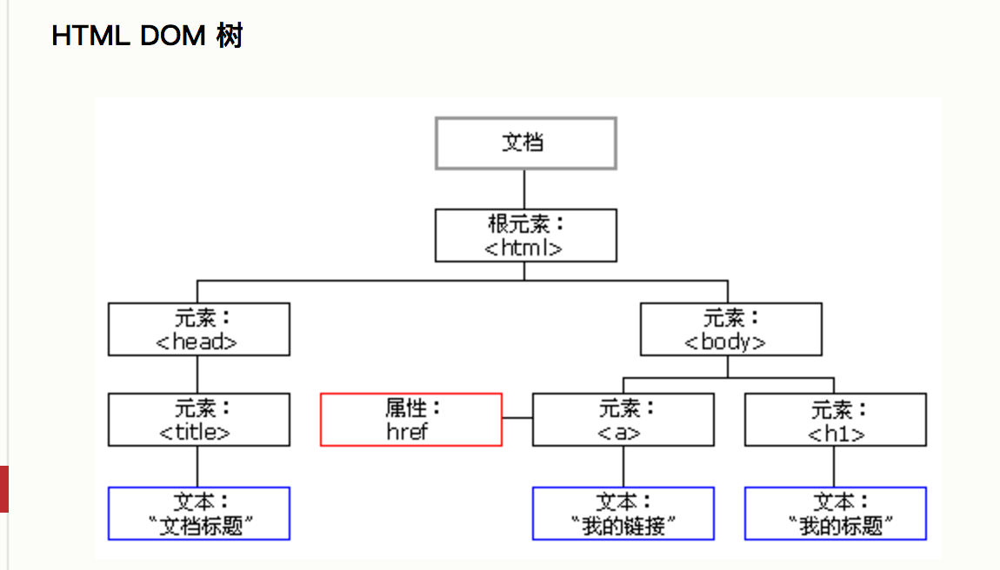
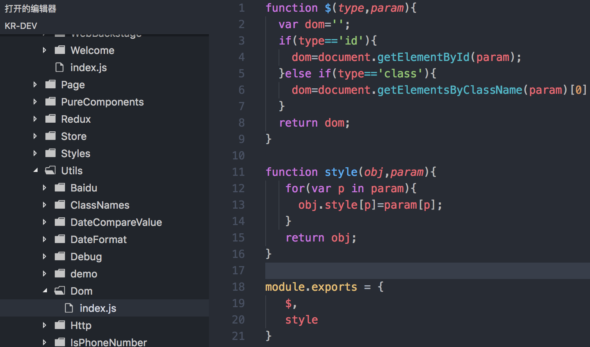
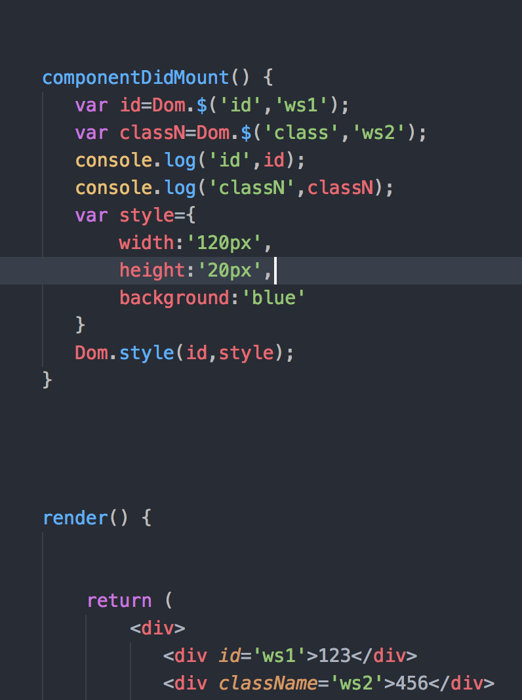

# 原生的dom操作

### 1）外行看来前端工程师的工作就是改页面（HTML、CSS），写脚本（JavaScript）。当你意识到你不是在改HTML而是在操作DOM时，你就升级了！ 那么什么是DOM？

```

解释: 文档对象模型 (DOM) 是HTML和XML文档的编程接口。它提供了对文档的结构化的表述，
并定义了一种方式可以使从程序中对该结构进行访问，从而改变文档的结构，样式和内容。
DOM 将文档解析为一个由节点和对象（包含属性和方法的对象）组成的结构集合。
简言之，它会将web页面和脚本或程序语言连接起来。

```
```
说白了DOM就是浏览器为JavaScript提供的一系列接口（通过window.document提供的），
通过这些接口我们可以操作web页面。 但DOM并不是编程语言，它是文档对象的模型，
该模型是独立于编程语言的。所以Web前端常讲的DOM API (web 或 XML 页面) = DOM + JS (脚本语言)。

```

```
我在这想要通过大白话说明一下我对它的看法：它好比木头这个实物，而我们的脚本或程序语言好比木匠的手艺，
最终的桌子或者椅子等等就好比web页面,各种各样的手艺作用于木头形成不同的形态物体。有不同的理解可以一起探讨。

```

### 2）Dom操作

```
DOM描绘了一个层次化的节点树，允许开发人员添加、移除和修改页面的某一部分。
由于HTML文档被浏览器解析后就是一棵DOM树，要改变HTML的结构，就需要通过JavaScript来操作DOM。
始终记住DOM是一个树形结构。

```



为了改变网页，你必须告诉 Javascript 改变哪一个节点。这就是操作 DOM。操作一个DOM节点实际上就是这么几个操作：

  1. 更新：更新该DOM节点的内容，相当于更新了该DOM节点表示的HTML的内容；

  2. 遍历：遍历该DOM节点下的子节点，以便进行进一步操作；

  3. 添加：在该DOM节点下新增一个子节点，相当于动态增加了一个HTML节点；

  4. 删除：将该节点从HTML中删除，相当于删掉了该DOM节点的内容以及它包含的所有子节点。


###### 获取节点
在操作一个DOM节点前，我们需要通过各种方式先拿到这个DOM节点。最常用的方法是document.getElementById()和document.getElementsByTagName()，以及CSS选择器document.getElementsByClassName()。

由于ID在HTML文档中是唯一的，所以document.getElementById()可以直接定位唯一的一个DOM节点。document.getElementsByTagName()和document.getElementsByClassName()总是返回一组DOM节点。要精确地选择DOM，可以先定位父节点，再从父节点开始选择，以缩小范围。


例如：

```
// 返回ID为'test'的节点：
var test = document.getElementById('test');

// 先定位ID为'test-table'的节点，再返回其内部所有tr节点：
var trs = document.getElementById('test-table').getElementsByTagName('tr');

// 先定位ID为'test-div'的节点，再返回其内部所有class包含red的节点：
var reds = document.getElementById('test-div').getElementsByClassName('red');

//获取节点list下面的子节点
var child=test.childNodes;
/*返回指定元素的子节点集合，包括元素节点和文本节点。
除了IE9和Firefox，其他浏览器都支持通过childNodes[i]获取第i个子节点。*/

//获取节点list下面的子节点
var child=test.children;
/*返回指定元素的子元素集合，只包括元素节点，不包括文本节点。
除了IE9和Firefox，其他浏览器都支持通过children[i]获取第i个子节点。
注意：children在IE中包含注释节点。*/

// 获取节点test下第一个、最后一个子节点：
var first = test.firstElementChild;  
var last = test.lastElementChild;
/*获取指定元素的第一个子元素节点，不会检测到文本节点。获取的第一个子节点下还有子节点的也不会检测到*/

// 获取节点test下第一个、最后一个子节点：
var first = test.firstChild;  
var last = test.lastChild;
/*获取指定元素的第一个子节点，可以是元素节点，也可以是文本节点。
问题：若父元素与第一个子元素之间存在空白节点，firstChild获取到的将是空白节点而不是第一个子元素。
解决：使用firstElementChild属性。
问题：IE6/7/8中不支持firstElementChild属性。
解决：使用children[0]属性。*/

//获取节点test的前一个、后一个兄弟节点：
var last=test.previousElementSibling;
var next=test.nextElementSibling;
/*previousSibling属性返回元素节点之前的兄弟节点（包括文本节点、注释节点）；
previousElementSibling属性只返回元素节点之前的兄弟元素节点（不包括文本节点、注释节点）；*/

//返回父节点
var parent=test.parentNode;
/*parentNode 属性以 Node 对象的形式返回指定节点的父节点。
如果指定节点没有父节点，则返回 null。*/

```

第二种方法是使用querySelector()和querySelectorAll()，需要了解selector（选择器）语法，然后使用条件来获取节点，更加方便：（我的理解就是你可以用各种选择器语法来获取)（HTML5引入了与jQuery选择器相似的DOM API）。

element = document.querySelector('selectors');
elementList = document.querySelectorAll('selectors');
其中参数selectors 可以包含多个CSS选择器，用逗号隔开。
例：
element = document.querySelector('.foo,.bar');//返回带有foo或者bar样式类的首个元素。

```
// 通过querySelector获取ID为q1的节点：querySelector()方法返回匹配指定CSS选择器元素的第一个子元素 。
var q1 = document.querySelector('#q1');

// 通过querySelectorAll获取q1节点内的符合条件的所有节点：返回一个数组
var ps = q1.querySelectorAll('div.highlighted > p');   (这里用到了子选择器)

```

注意：低版本的IE<8不支持querySelector和querySelectorAll。IE8仅有限支持。

```
  严格地讲，我们这里的DOM节点是指Element，但是DOM节点实际上是Node，在HTML中，Node包括Element、Text、Attr 等很多种，
  以及根节点Document类型，根节点Document已经自动绑定为全局变量document。但是，绝大多数时候我们只关心Element，
  也就是实际控制页面结构的Node，其他类型的Node忽略即可,可以提一下dom中的三大节点关系：分别是元素节点，文本节点，属性节点：
  元素节点：构成了DOM的基础。文档结构中，<html>是根元素，代表整个文档，其他的还有<head>,<body>,<p>,<span>等等。元素节点之间可以相互包含(当然遵循一定的规则)
  文本节点：包含在元素节点中。
  属性节点：元素都可以包含一些属性，属性的作用是对元素做出更具体的描述，比如id,name之类的。（由此我们也可以看出文本和属性节点也是一定程度上要基于元素节点表示出来,所以也不详细介绍）

```
 
 


### 3)详细说明操作

1. 更新DOM

拿到一个DOM节点后，我们可以对它进行更新。

可以直接修改节点的文本，方法有两种：

一种是修改innerHTML属性，这个方式非常强大，不但可以修改一个DOM节点的文本内容，还可以直接通过HTML片段修改DOM节点内部的子树：

```
// 获取<p id="p-id">...</p>
var p = document.getElementById('p-id');
// 设置文本为abc:
p.innerHTML = 'ABC'; // <p id="p-id">ABC</p>
// 设置HTML:
p.innerHTML = 'ABC <span style="color:red">RED</span> XYZ';
// <p>...</p>的内部结构已修改

```

用innerHTML时要注意，是否需要写入HTML（标签）。如果写入的字符串是通过网络拿到了(传过来的)，要注意对字符编码来避免XSS攻击。

第二种是修改innerText或textContent属性，这样可以自动对字符串进行HTML编码，保证无法设置任何HTML标签：

```
<p id="p">这<br>是&nbsp;&nbsp;&nbsp;一段&amp;话&lt;你好&gt;<br></p>
//&amp; 就是 &
console.log(p.innerText)
console.log(p.textContent)
console.log(p.innerHTML)

```

```
innerText:
这
是   一段&话<你好>

textContent:
这是   一段&话<你好>

innerHTML:
这<br>是&nbsp;&nbsp;&nbsp;一段&amp;话&lt;你好&gt;

```
结论：

innerText就是在页面上看到的字符串，相当于选中页面上的文本，复制，粘贴
textContent处理html转义字符，但是忽略格式标签（例如br标签,hr标签），相当于把格式标签去掉之后，按照innerText处理。

innerHTML是符合W3C标准的属性，而innerText只适用于IE浏览器，因此，尽可能地去使用innerHTML，而少用innerText，如果要输出不含HTML标签的内容，可以使用innerHTML取得包含HTML标签的内容后，再用正则表达式去除HTML标签，下面是一个简单的符合W3C标准的示例：

<a href="javascript:alert(document.getElementById('test').innerHTML.replace(/<.+?>/gim,''))">无HTML,符合W3C标准</a>


2. 插入DOM

当我们获得了某个DOM节点，想在这个DOM节点内插入新的DOM，应该如何做？

如果这个DOM节点是空的，例如，<div></div>，那么，直接使用innerHTML = '<span>child</span>'就可以修改DOM节点的内容，相当于“插入”了新的DOM节点。

如果这个DOM节点不是空的，那就不能这么做，因为innerHTML会直接替换掉原来的所有子节点。

有两个办法可以插入新的节点。一个是使用appendChild，把一个子节点添加到父节点的最后一个子节点。例如：

```
<!-- HTML结构 -->
<p id="js">JavaScript</p>
<div id="list">
    <p id="java">Java</p>
    <p id="python">Python</p>
    <p id="scheme">Scheme</p>
</div>

```
```
把<p id="js">JavaScript</p>添加到<div id="list">的最后一项：

```

```
var
    js = document.getElementById('js'),
    list = document.getElementById('list');
list.appendChild(js);

```
现在，HTML结构变成了这样：

```
<!-- HTML结构 -->
<div id="list">
    <p id="java">Java</p>
    <p id="python">Python</p>
    <p id="scheme">Scheme</p>
    <p id="js">JavaScript</p>
</div>

```
因为我们插入的js节点已经存在于当前的文档树，因此这个节点首先会从原先的位置删除，再插入到新的位置。

更多的时候我们会从零创建一个新的节点，然后插入到指定位置：

```
var
    list = document.getElementById('list'),
    haskell = document.createElement('p');
haskell.id = 'haskell';
haskell.innerText = 'Haskell';
list.appendChild(haskell);

```
这样我们就动态添加了一个新的节点：

```
<!-- HTML结构 -->
<div id="list">
    <p id="java">Java</p>
    <p id="python">Python</p>
    <p id="scheme">Scheme</p>
    <p id="haskell">Haskell</p>
</div>

```
```
动态创建一个节点然后添加到DOM树中，可以实现很多功能。举个例子，下面的代码动态创建了一个<style>节点，然后把它添加到<head>节点的末尾，这样就动态地给文档添加了新的CSS定义：

```


```
var d = document.createElement('style');
d.setAttribute('type', 'text/css');
d.innerHTML = 'p { color: red }';
document.getElementsByTagName('head')[0].appendChild(d);

```

###### insertBefore

如果我们要把子节点插入到指定的位置怎么办？可以使用parentElement.insertBefore(newElement, referenceElement);，子节点会插入到referenceElement之前。

还是以上面的HTML为例，假定我们要把Haskell插入到Python之前：

```
<!-- HTML结构 -->
<div id="list">
    <p id="java">Java</p>
    <p id="python">Python</p>
    <p id="scheme">Scheme</p>
</div>

```
可以这么写：

```
var
    list = document.getElementById('list'),
    ref = document.getElementById('python'),
    haskell = document.createElement('p');
haskell.id = 'haskell';
haskell.innerText = 'Haskell';
list.insertBefore(haskell, ref);

```
新的HTML结构如下：

```
<!-- HTML结构 -->
<div id="list">
    <p id="java">Java</p>
    <p id="haskell">Haskell</p>
    <p id="python">Python</p>
    <p id="scheme">Scheme</p>
</div>

```
可见，使用insertBefore重点是要拿到一个“参考子节点”的引用。很多时候，需要循环一个父节点的所有子节点，可以通过迭代children属性实现：

```
var
    i, c,
    list = document.getElementById('list');
for (i = 0; i < list.children.length; i++) {
    c = list.children[i]; // 拿到第i个子节点
}

```

3. 删除DOM

要删除一个节点，首先要获得该节点本身以及它的父节点，然后，调用父节点的removeChild把自己删掉：

```
// 拿到待删除节点:
var self = document.getElementById('to-be-removed');
// 拿到父节点:
var parent = self.parentElement;
// 删除:
var removed = parent.removeChild(self);
removed === self; // true

```
注意到删除后的节点虽然不在文档树中了，但其实它还在内存中，可以随时再次被添加到别的位置。

当你遍历一个父节点的子节点并进行删除操作时，要注意，children属性是一个只读属性，并且它在子节点变化时会实时更新。

例如，对于如下HTML结构：

```
<div id="parent">
    <p>First</p>
    <p>Second</p>
</div>

```

当我们用如下代码删除子节点时：

```
var parent = document.getElementById('parent');
parent.removeChild(parent.children[0]);
parent.removeChild(parent.children[1]); // <-- 浏览器报错

```

浏览器报错：parent.children[1]不是一个有效的节点。原因就在于，当<p>First</p>节点被删除后，parent.children的节点数量已经从2变为了1，索引[1]已经不存在了。

因此，删除多个节点时，要注意children属性时刻都在变化。
