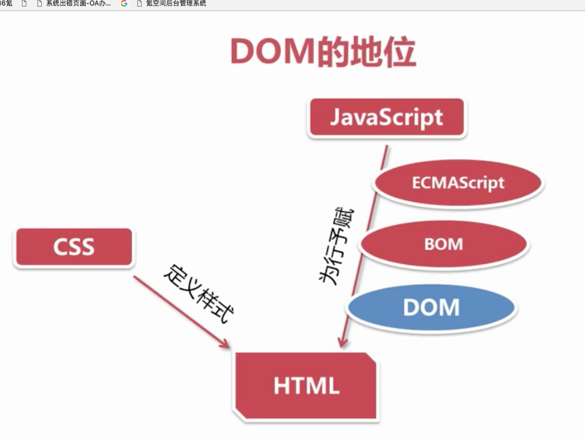
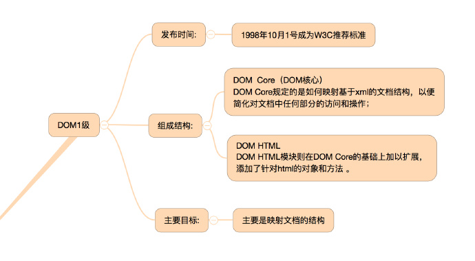
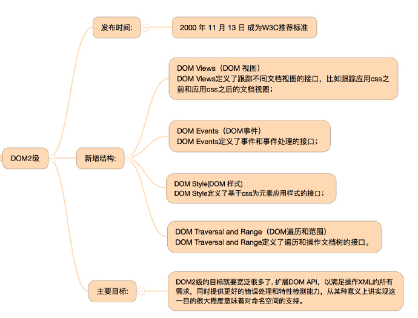
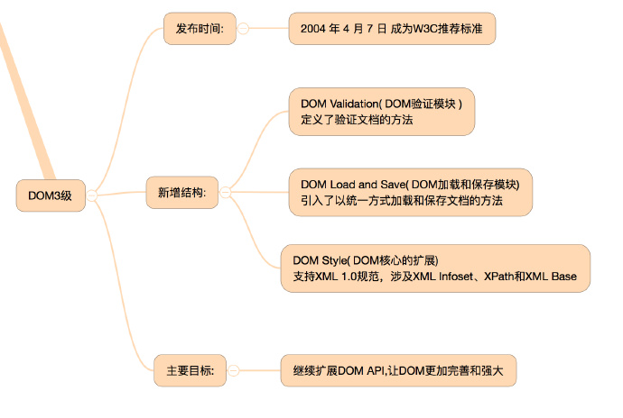
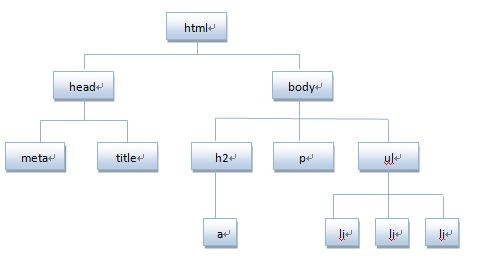
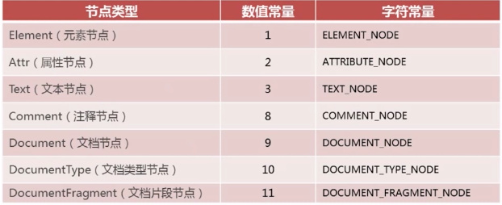
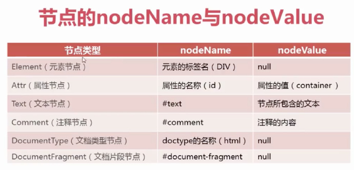

# DOM 历史

  可以参考此链接或者也可以看慕课网视频:
  https://github.com/jawil/blog/issues/9

## 1.什么是DOM  

```
 DOM，文档对象模型（Document Object Model）。DOM是 W3C（万维网联盟）的标准，
 DOM定义了访问HTML和XML文档的标准。在W3C的标准中，DOM是独于平台和语言的接口(API)，
 它允许程序和脚本动态地访问和更新文档的内容、结构和样式。
 (换句话说，这是表示和处理一个HTML或XML文档的常用方法,Dom技术使得用户页面可以动态地变化，
   如可以动态地显示或隐藏一个元素，改变它们的属性，增加一个元素等)。

```

```

 如：
 <p id="purchases" title="">food<p>  

 var shopping = document.getElementById("purchases");  
 shopping.setAttribute("title","a list of goods");

 其中，getElementById()，是DOM中的一个方法，可用于查找文档中的一个特定的元素，即id=purchases的元素，
 在此例中将id=purchases的元素p赋值给shopping。setAttribute()方法，用于对属性节点
 的值做出修改，此处将元素p中title属性的值设置为"a list of goods"。
 当然DOM中还提供了许多其他的方法，使我们对文档的内容、结构和样式进行修改，此处不再列举。


```


### DOM和JavaScript的关系:

```
我们都知道JavaScript是一种编程语言，而.js文件是用JavaScript编写的代码，那么DOM在其中担任什么样的角色呢？
 DOM不是一种编程语言，但如果没有DOM，JavaScript语言不会有任何网页。我们用JavaScript对网页进行的所
 有操作都是通过DOM进行的。

 下面用一段代码更直观地显示JavaScript和DOM的区别，代码中加粗的部分就是DOM：
 var Tags = **document.getElementsByTagName("a")**;
         for(var i = 0; i < **Tags.length**; i++)
         {
              alert("Href of this a element is :" + **Tags[i].href** + "\n");
         }
         这样一来，哪些是核心JavaScript，哪些是DOM，各自起什么作用就可以一目了然。（此处不在对代码进行解释）。

这样一来，哪些是核心JavaScript，哪些是DOM，各自起什么作用就可以一目了然。

 备注：DOM并不是编程语言，它是文档对象的模型，该模型是独立于编程语言的。比如我们在
 Python(面向对象、直译的电脑程序语言)中也可以操作DOM：

 import xml.dom.minidom as m
 doc = m.parse("C:\\Projects\\Py\\chap1.xml");
 doc.nodeName # DOM property of document object;
 p_list = doc.getElementsByTagName("para");

 所以Web前端常讲的DOM API (web 或 XML 页面) = DOM + JS (脚本语言);

```

### W3C DOM由以下三部分组成

```
核心DOM - 针对任何结构化文档的标准模型
XML DOM - 针对 XML 文档的标准模型
HTML DOM - 针对 HTML 文档的标准模型

```
DOM（文档对象模型）是针对xml经过扩展用于html的应用程序编程接口，我们又叫API。
DOM把整个页面映射为一个多层的节点结构，html或xml页面中的每个组成部分都是某种类型的节点，
这些节点又包含着不同类型的数据。


## 2、DOM的地位

```
我们知道，一个网页是由html来搭建结构的，通过css来定义网页的样式，而JavaScript赋予了页面的行为，通过它我们可以与页面进行交互，实现页面的动画效果等等。那javascript究竟通过什么来实现的呢？通过ECMAScript这个标准，我们可以编写程序让浏览器来解析，利用ECMAScript，我们可以通过BOM对象（即browser object model）来操作浏览器窗口、浏览器导航对象(navigator)、屏幕分辨率(screen)、浏览器历史(history)、cookie等等。但这个通过BOM来实现的交互远远不够。要实现页面的动态交互和效果，操作html才是核心。那如何操作html呢？对，就是DOM，简单的说，DOM给我们提供了用程序来动态控制html的接口，也就是早期的DHTMl的概念。因此，DOM处在javascript赋予html具备动态交互和效果的能力的核心地位上。

```




## 3、DOM的发展－DOM0、DOM1、DOM2、DOM3的区别


（DOM(文档对象模型)是针对HTML和XML文档的一个API，其脱胎于DHTML。
    DOM可以将任意HTML和XML文档描绘成一个由多层节点构成的结构。）


**3.1、DOM0**

```
JavaScript在早期版本中提供了查询和操作Web文档的内容API（如：图像和表单），在JavaScript中定义了'images'、'forms'等，
因此我们可以像下面这样访问第一张图片或名为“user”的表单：

  document.images[0]
  document.forms['user']

这实际上是未形成标准的试验性质的初级阶段的DOM，现在习惯上被称为DOM0，即：第0级DOM。由于DOM0在W3C进行标准化之前出现，
还处于未形成标准的初期阶段，这时Netscape(网景)和Microsoft(微软)各自推出自己的第四代浏览器，自此DOM便开始出各种问题。

```

**3.2、DOM0与DHTML**

```
Netscape Navigator 4和IE4分别发布于1997年的6月和10月，这两种浏览器都大幅扩展了DOM，使JavaScript的功能大大增加，而此时也开始出现一个新名词：DHTML。

DHTML是Dynamic HTML（动态HTML）的简称。DHTML并不是一项新技术，而是将HTML、CSS、JavaScript技术组合的一种描述。即：

  1.利用HTML把网页标记为各种元素
  2.利用CSS设置元素样式及其显示位置
  3.利用JavaScript操控页面元素和样式


利用DHTML，看起来可以很容易的控制页面元素，并实现一些原本很复杂的效果（如：通过改变元素位置实现动画）。但事实并非如此，因为没有规范和标准，两种浏览器对相同功能的实现却完全不一样。为了保持程序的兼容性，程序员必须写一些探查代码以检测JavaScript是运行于哪种浏览器之下，并提供与之对应的脚本。JavaScript陷入了前所未有的混乱，DHTML也因此在人们心中留下了很差的印象。

我们在阅读DOM标准的时候，经常会看到DOM0级这样的字眼，实际上DOM0级这个标准是不存在的。所谓DOM0级只是DOM历史坐标系中的一个参照点而已，具体地说DOM0级就是指IE4.0和Netscape navigator4.0最初支持的那个DHTML。

```

**3.3、DOM1的出现**

```
在浏览器厂商进行浏览器大战的同时，W3C结合大家的优点推出了一个标准化的DOM，并于1998年10月完成了第一级 DOM，即：DOM1。W3C将DOM定义为一个与平台和编程语言无关的接口，通过这个接口程序和脚本可以动态的访问和修改文档的内容、结构和样式。

DOM1级主要定义了HTML和XML文档的底层结构。在DOM1中，DOM由两个模块组成：DOM Core（DOM核心）和DOM HTML。其中，DOM Core规定了基于XML的文档结构标准，通过这个标准简化了对文档中任意部分的访问和操作。DOM HTM则在DOM核心的基础上加以扩展，添加了针对HTML的对象和方法，如：JavaScript中的Document对象。(0)

```



**3.4、DOM2**

```
在DOM1的基础上DOM2引入了更多的交互能力，也支持了更高级的XML特性。DOM2将DOM分为更多具有联系的模块。DOM2级在原来DOM的基础上又扩充了鼠标、用户界面事件、范围、遍历等细分模块，而且通过对象接口增加了对CSS的支持。DOM1级中的DOM核心模块也经过扩展开始支持XML命名空间。在DOM2中引入了下列模块，在模块包含了众多新类型和新接口：

  1.DOM视图（DOM Views）：定义了跟踪不同文档视图的接口
  2.DOM事件（DOM Events）：定义了事件和事件处理的接口
  3.DOM样式（DOM Style）：定义了基于CSS为元素应用样式的接口
  4.DOM遍历和范围（DOM Traversal and Range）：定义了遍历和操作文档树的接口

```



**3.5、DOM3**

```
DOM3级：进一步扩展了DOM，引入了以统一方式加载和保存文档的方法，它在DOM Load And Save这个模块中定义；同时新增了验证文档的方法，是在DOM Validation这个模块中定义的。

DOM3进一步扩展了DOM，在DOM3中引入了以下模块：

  1.DOM加载和保存模块（DOM Load and Save）：引入了以统一方式加载和保存文档的方法
  2.DOM验证模块（DOM Validation）：定义了验证文档的方法
  3.DOM核心的扩展（DOM Style）：支持XML 1.0规范，涉及XML Infoset、XPath和XML Base


```



## 4.认识DOM


DOM可以将任何HTML描绘成一个由多层节点构成的结构。节点分为12种不同类型，每种类型分
别表示文档中不同的信息及标记。
每个节点都拥有各自的特点、数据和方法，也与其他节点存在某种关系。节点之间的关系构成了层次，
而所有页面标记则表现为一个以特定节点为根节点的树形结构。

```
先来看看下面代码:
<!DOCTYPE html>
  <html>
  <head>
     <meta charset="utf-8">
      <title>DOM</title>
  </head>
  <body>
      <h2><a href="http://www.baidu.com">javascript DOM</a></h2>
      <p>对HTML元素进行操作，可添加、改变或移除css样式等</p>
      <ul>
          <li>Javascript</li>
          <li>DOM</li>
          <li>CSS</li>
      </ul>
  </body>
  </html>

```

将HTML代码分解为DOM节点层次图:




HTML文档可以说由节点构成的集合，DOM节点有:
  1. 元素节点：上图中<html>、<body>、<p>等都是元素节点，即标签。
  2. 文本节点:向用户展示的内容，如<li>...</li>中的JavaScript、DOM、CSS等文本。
  3. 属性节点:元素属性，如<a>标签的链接属性href="http://www.baidu.com"。


## 5.文档类型发展史

我们说DOM文档对象模型是从文档中抽象出来的，DOM操作的对象也是文档，因此我们有必要了解一下文档的类型。
文档随着历史的发展演变为多种类型，如下:


**5.1、GML**

```
GML(Generalized Markup Language, 通用标记语言)是1960年代的一种IBM文档格式化语言，用于描述文档的组织结构、
各部件及其相互关系。GML在文档具体格式方面，为文档员提供了一些方便，他们不必再为IBM的打印机格式化语言SCRIPT要求
的字体规范、行距以及页面设计等浪费精力。这个IBM的GML包括1960年代的GML和1980年代的ISIL。


```

**5.2、SGML**

```
SGML(Standard Generalized Markup Language, 标准通用标记语言)是1986年基于IBM的GML制定ISO标准(ISO 8879)。
SGML是现时常用的超文本格式的最高层次标准，是可以定义标记语言的元语言，甚至可以定义不必采用"<>"的常规方式。
由于SGML的复杂，因而难以普及。HTML和XML同样衍生于SGML，XML可以被认为是SGML的一个子集，而HTML是SGML的一个应用。

```

**5.3、HTML**

```
HTML(HyperText Markup Language, 超文本标记语言)是为“网页创建和其它可在网页浏览器中看到的信息”设计
的一种标记语言。HTML被用来结构化信息——例如标题、段落和列表等等，也可用来在一定程度上描述文档的外观和语义。
1982年，蒂姆·伯纳斯-李为使世界各地的物理学家能够方便的进行合作研究，创建了使用于其系统的HTML。之后HTML
又不断地扩充和发展，成为国际标准，由万维网联盟（W3C）维护。第一个正式标准是1995年发布的RFC 1866(HTML 2.0)。

```

**5.4、XML**

```
XML(eXtensible Markup Language, 可扩展标记语言)是专家们使用SGML精简制作，并依照HTML的发展经验
，产生出一套使用上规则严谨，但是简单的描述数据语言。XML在1995年开始有雏形，在1998二月发布为W3C的标准(XML1.0)

```

**5.5、XHTML**

```
XHTML(eXtensible HyperText Markup Language, 可扩展超文本标记语言)的表现方式与超文本标记语言（HTML）
类似，不过语法上更加严格。从继承关系上讲，HTML是一种基于标准通用标记语言(SGML)的应用，是一种非常灵活的置标语言，
而XHTML则基于可扩展标记语言(XML)，XML是SGML的一个子集。XHTML 1.0在2000年1月26日成为W3C的推荐标准。

```

## 6、DOM节点类型

```
DOM1级定义了一个Node接口，这个Node接口在javascript中是作为Node类型来实现的。除了IE以外，其他所有浏览器
都可以访问这个类型。每个节点都有一个nodeType属性，用于表明节点的类型。节点类型通过定义数值常量和字符常量两种
方式来表示，IE只支持数值常量。节点类型一共有12种，这里介绍常用的7种类型。如下图：

```




看下面这个例子:

```
<!DOCTYPE html>  
<html lang="en">  
<head>  
    <meta charset="UTF-8">  
    <title>DocumentFragment文档片段节点</title>  
</head>  
<body>
<!-- tip区域 -->
    <div id="tip">test1</div>
    <ul class="list-node">
    <li>test2<li>
    </ul>  
    <script>  
        var frag = document.createDocumentFragment();  
        for (var i = 0; i < 10; i++) {  
            var li = document.createElement("li");  
            li.innerHTML = "List item" + i;  
            frag.appendChild(li);  
        }  
        document.getElementById("list-node").appendChild(frag);  
    </script>  
</body>  
</html>  

```

(1)Element(元素节点)：


是组成文档树的重要部分，它表示了html、xml文档中的元素。通常元素因为有子元素、文本节点或者两者的结合，
元素节点是唯一能够拥有属性的节点类型。
例子中的:html、heade、meta、title、body、div、ul、li、script都属于Element(元素节点);


(2)Attr(属性节点)：


代表了元素中的属性，因为属性实际上是附属于元素的，因此属性节点不能被看做是元素的子节点。因而在DOM中属性
没有被认为是文档树的一部分。换句话说，属性节点其实被看做是包含它的元素节点的一部分，它并不作为单独的一个节
点在文档树中出现。
例子中的:lang、charset、id、class都属于Attr(属性节点);


(3)Text(文本节点)：


是只包含文本内容的节点，在xml中称为字符数据，它可以由更多的信息组成，也可以只包含空白。在文档树中元
素的文本内容和属性的文本内容都是由文本节点来表示的。
例子中的:DocumentFragment文档片段节点、test1、test2、元素节点之后的空白区域都属于Text(文本节点);


(4)Comment(注释节点)：

表示注释的内容
例子中的:<!-- tip区域 -->都属于Comment(注释节点);


(5)Document(文档节点) ：


是文档树的根节点，它是文档中其他所有节点的父节点。要注意的是，文档节点并不是html、xml文档的根元素，
因为在xml文档中，处理指令、注释等内容可以出现在根元素之外，所以我们在构造DOM树的时候，根元素并不适合
作为根节点，因此就有了文档节点，而根元素是作为文档节点的子节点出现的。
例子中的：<!DOCTYPE html>、html作为Document(文档节点)的子节点出现;


(6)DocumentType(文档类型节点)：


每一个Document都有一个DocumentType属性，它的值或者是null，或者是DocumentType对象。比如声明
文档类型时<!doctype html>就是文档类型节点。
例子中的：<!DOCTYPE html> 就属于DocumentType(文档类型节点);


(7)DocumentFragment(文档片段节点)：


是轻量级的或最小的Document对象，它表示文档的一部分或者是一段，不属于文档树。不过它有一种特殊的行为，该行为
使得它非常有用。比如：当请求把一个DocumentFragment节点插入到文档的时候，插入的不是DocumentFragment自身，
而是它的所有的子孙节点。这使得DocumentFragment成了有用的占位符，暂时存放那些一次插入文档的节点，同时它还有
利于实现文档的剪切、复制和粘贴等操作。
例子中的:var frag = document.createDocumentFragment();就属于DocumentFragment(文档片段节点);





## 7、DOM的nodeType、nodeName、nodeValue

**7.1 nodeType**

```
通过DOM节点类型，我们可知，可以通过某个节点的nodeType属性来获得节点的类型，节点的类型可以是数值常量或者字符常量。
示例代码如下：

```

```
<!DOCTYPE html>  
<html>  
<head lang="en">  
    <meta charset="UTF-8">  
    <title>nodeType</title>  
</head>  
<body>  
    <div id="container">这是一个元素节点</div>  
    <script>  
        var divNode = document.getElementById('container');  
        /*
        IE中只支持数值常量，因为低版本IE浏览器没有内置Node对象，其他浏览器数值常量和字符常量都支持，因此可
        以直接用数值常量判断，这里为了比较两种写法，便都写在了这里  
        */  
        if (divNode.nodeType == Node.ELEMENT_NODE || divNode.nodeType === 1) {  
            alert("Node is an element.");  
        }         
    </script>  
</body>  
</html>  

```

**7.2 nodeName和nodeValue**

先看示例代码:

```

<!DOCTYPE html>  
<html>  
<head lang="en">  
    <meta charset="UTF-8">  
    <title>nodeName,nodeValue</title>  
</head>  
<body>  
    <!--nodeName,nodeValue实验-->  
    <div id="container">这是一个元素节点</div>  
    <script>  
        var divNode = document.getElementById('container');  
        console.log(divNode.nodeName + "/" + divNode.nodeValue);     
        //结果:    DIV/null  

        var attrNode = divNode.attributes[0];  
        console.log(attrNode.nodeName + "/" + attrNode.nodeValue);      
        //结果：   id/container  

        var textNode = divNode.childNodes[0];  
        console.log(textNode.nodeName + "/" + textNode.nodeValue);      
        //结果：   #text/这是一个元素节点  

        var commentNode = document.body.childNodes[1];  
        //表示取第二个注释节点，因为body下面的第一个注释节点为空白符。  
        console.log(commentNode.nodeName + "/" +commentNode.nodeValue);  
        //结果：  #comment/nodeName,nodeValue实验  

        console.log(document.doctype.nodeName + "/" + document.doctype.nodeValue);   
        //结果： html/null  

        var frag = document.createDocumentFragment();  
        console.log(frag.nodeName + "/" + frag.nodeValue);    
        //结果： #document-fragment/null  
    </script>  
</body>  
</html>  

```
根据实验，得出以下汇总表格:


