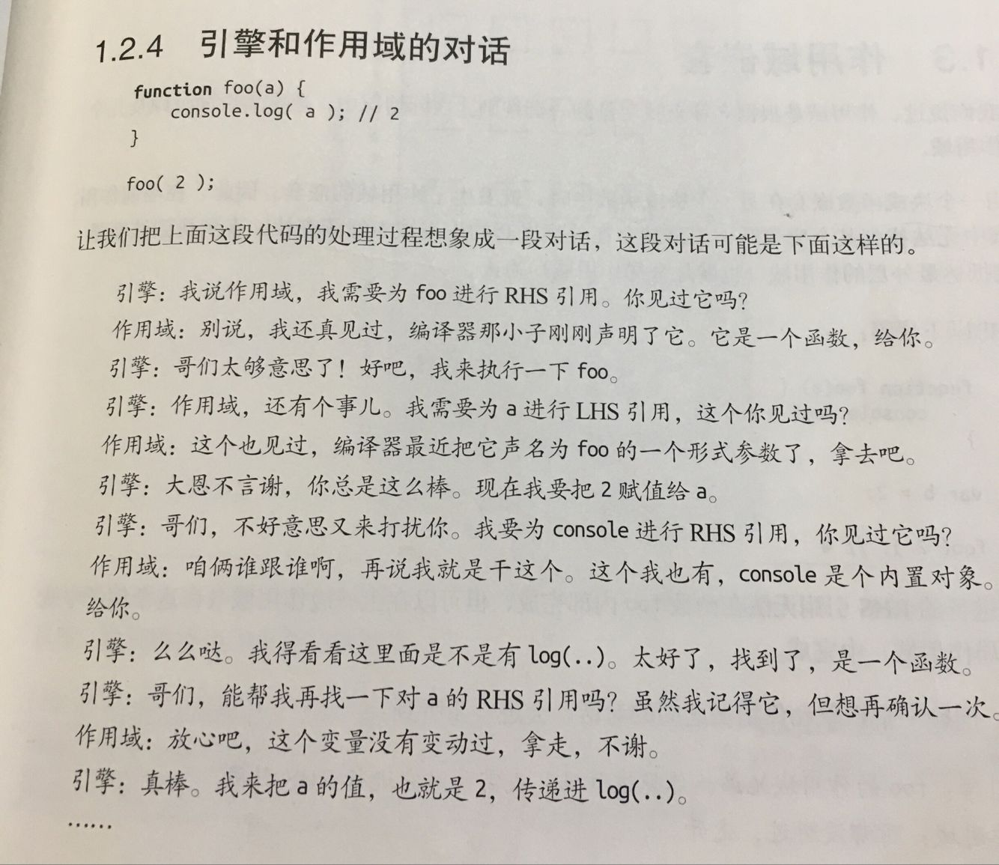
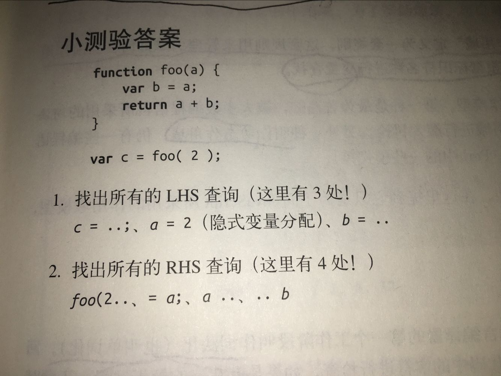
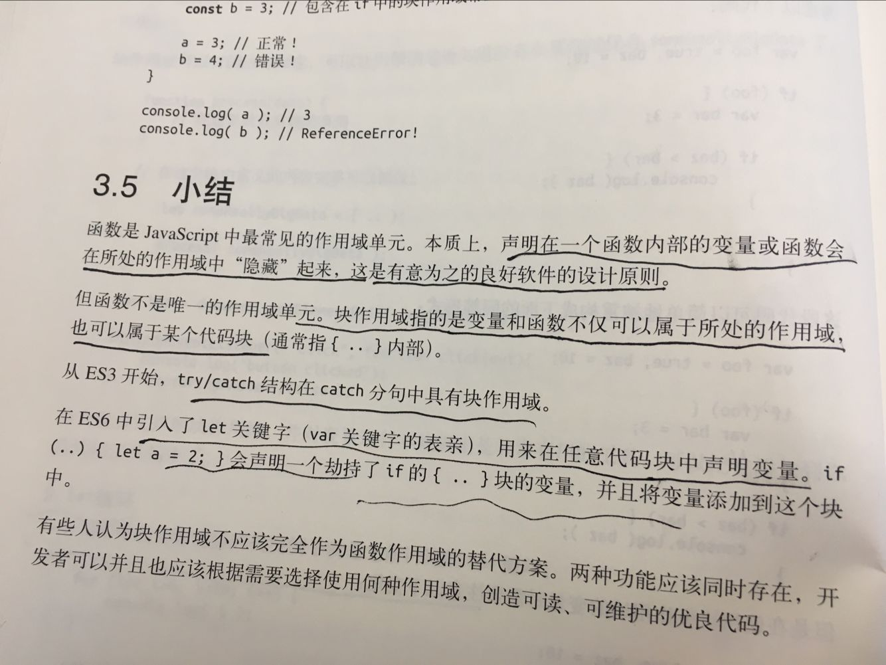

# 《你不知道的javascript》
##一、引擎
####浏览器的核心是两部分：渲染引擎和JavaScript解释器（又称JavaScript引擎）
#####（1）渲染引擎
>渲染引擎的主要作用是，将网页从代码“渲染”为用户视觉上可以感知的平面文档。不同的浏览器有不同的渲染引擎。

>渲染引擎处理网页，通常分成四个阶段。

>解析代码：HTML代码解析为DOM，CSS代码解析为CSSOM（CSS Object Model）

>对象合成：将DOM和CSSOM合成一棵渲染树（render tree）

>布局：计算出渲染树的布局（layout）

>绘制：将渲染树绘制到屏幕


>注：重流和重绘

>渲染树转换为网页布局，称为“布局流”（flow）；布局显示到页面的这个过程，称为“绘制”（paint）。它们都具有阻塞效应，并且会耗费很多时间和计算资源。

>页面生成以后，脚本操作和样式表操作，都会触发重流（reflow）和重绘（repaint）。用户的互动，也会触发，比如设置了鼠标悬停（a:hover）效果、页面滚动、在输入框中输入文本、改变窗口大小等等。

>重流和重绘并不一定一起发生，重流必然导致重绘，重绘不一定需要重流。比如改变元素颜色，只会导致重绘，而不会导致重流；改变元素的布局，则会导致重绘和重流。

#####（2）JavaScript引擎
>JavaScript引擎的主要作用是，读取网页中的JavaScript代码，对其处理后运行。

>它进行词法分析，就是将源代码分解成一系列具有明确含义的符号或字符串。然后用语法分析器分析这些符号，将其构建成语法树。
接着四个 JIT（Just-In-Time ）进程开始参与进来，分析和执行解析器所生成的字节码。

>简单来说，JavaScript 引擎会加载你的源代码，把它分解成字符串（又叫做分词），再 把这些字符串转换 成编译器可以理解的字节码，然后执行这些字节码。一旦编译过程中产生了机器代码，引擎就会向浏览器暴露所有的数据类型、操作符、对象、在 ECMA 标准中指定的函数、或任何运行时需要使用的东西。

>注：Just-In-Time “即时编译”即字节码只在运行时编译，用到哪一行就编译哪一行，并且把编译结果缓存（inline cache）。通常，一个程序被经常用到的，只是其中一小部分代码，有了缓存的编译结果，整个程序的运行速度就会显著提升。


####编译原理   

>1)词法解析，将字符组成的字符串解析成有意义的代码块。 var a = 2；   解析成 var ， a ，= ，2 ，" "；

>2)语法分析，将词法单元流转换成一个由元素逐级嵌套所组成的代表了程序语法结构的树（抽象语法树 AST）。

>3)代码生成,将AST转换成可执行代码的过程称为代码生成。


####分工明确   

>引擎：从头到尾负责整个javascript程序的编译和执行过程

>编译器：引擎的好朋友之一，负责语法分析及代码生成

>作用域：负责收集并维护有所有声明的变量组成的一系列查询，并实施一套严格的规则，确定当前执行的代码对这些变量的访问权限。


##二、作用域
####定义：   
>负责收集并维护有所有声明的变量组成的一系列查询，并实施一套严格的规则，确定当前执行的代码对这些变量的访问权限。


####作用域嵌套

>一个块或者函数嵌套在另一个块或者函数中，就发生了作用域的嵌套。


>引擎从当前的作用域开始查找变量，如果找不到，就会向上一级继续查找。底抵达最外层的全局作用域时，无论找到还是没找到，查找过程都会停止。


>var  a = 2; 到底是怎样解析的？

>变量的赋值操作会执行两个动作，首先编译器会在当前作用域中声明一个变量（如果之前没声明过），然后在执行时引擎会在作用域中查找这个变量，如果能找到就会对它赋值


####LHS查询 和 RHS查询

>LHS(Left-hand Side)引用和RHS(Right-hand Side)引用。通常是指等号（赋值运算）的左右边的引用。

>LHS引用用来赋值运算，RHS引用用来获取值。
 
>例子1：
>var a = 2;
 
>例子1中，这个a就是LHS引用。
 
>例子2：
>console.log(a)
 
>例子2中，这个a就是RHS引用。
 
>例子3：

```
 function foo(a) {
        alert(a);
    }
    foo(2);
 
```
>例子3中，发生了一个隐含了a的LHS引用，就是a = 2，将函数的第一个参数赋值2。

>LHS试图找到变量的容器本身 RHS找到某个变量的值



>下面有3处LHS和4处RHS，并分析引擎是怎么在作用域中进行变量的查找的

  
```

function foo(a){
  var b = a;
  return a+b;
}
var c = foo(2);
  

```


#####LHS 和 RHS异常情况（找不到怎么办）

>不成功的RHS引用会抛出RefrenceError

>不成功的LHS引用会创建一个全局变量（非严格模式下）或者抛出RefrenceError（严格模式）


#####函数作用域和块作用域

######函数作用域
>在任意代码片段外部添加包装函数，可以将内部的变量和函数定义“隐藏”起来，外部作用域无法访问包装函数内部的任何内容


>（在很多库中通常会在全局作用域中声明一个名字足够独特的变量，通常是一个对象。这个对象作为命名空间，所有需要暴露给外界的功能都能成为一个对象（命名空间）的属性，而不是将自己的标识符暴露在顶级的词法作用域中。)

######块作用域

>表面上javascript并没有块作用域的功能
```
var foo =true;
if(foo){
  var bar = foo;
  bar = something(bar);
  console.log(bar)
}
```
>bar声明在if块内部，仅在if中使用，但是使用var声明变量是，它在哪里都一样，因为他们始终都会属于外部作用域。以上代码是为了风格更易读而伪装出的形式上的快作用于，要确保没在作用域其他地方使用bar只能靠自觉。

>let关键字可以将变量绑定到所在的任意作用域中。用let将变量附加在一个已经存在的作用域的行为是隐式的，所以在生命中任意位置都可以使用{...}来为let创建一个块，如果需要重构，整个块可以方便的移动。

>let进行的声明不会在块作用域中进行提升

```
{
  console.log(bar) //RegerenceError
  let bar = 2;
}
```

####let循环

```
for (let i=0;i<10;i++){
  console.log(i);  
}
console.log(i) //ReferenceError
```

>let循环头部不仅将你绑定到了for循环的块中，事实上它将重新绑定到了循环的每一个迭代中，确保使用上一个循环迭代结束时的值重新进行赋值。

>let声明附属于一个新的作用域而不是当前的函数作用域
>const同样是用来创建块级作用域变量的，但是其值是固定的（常量）。之后任何试图修改值得操作都会引起错误。


##总结：



