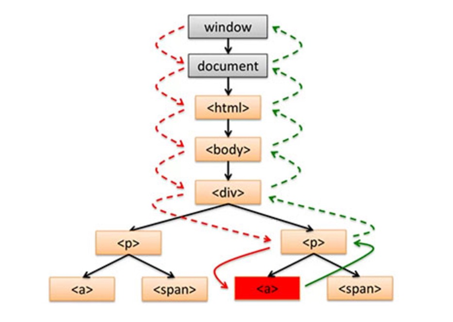
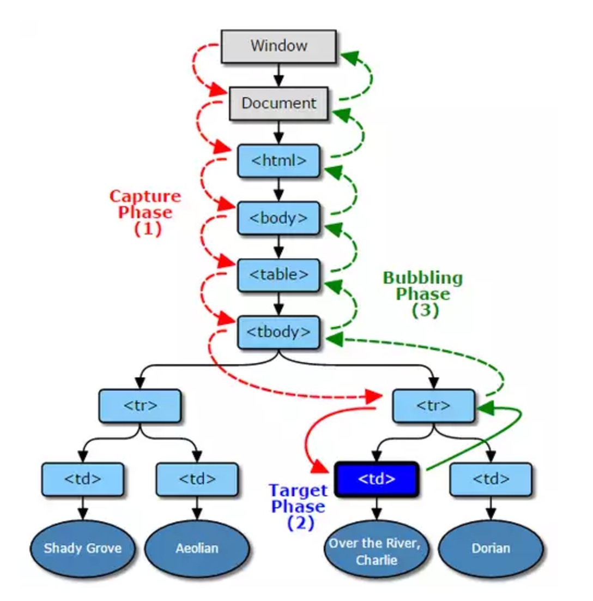

# DOM 事件

何为 DOM 事件，HTML DOM 使JavaScript 有能力对 HTML 事件做出反应。（例如，点击 DOM 元素，键盘被按，输入框输入内容以及页面加载完毕等）


## 事件流

DOM 事件流（event flow）存在三个阶段：事件捕获（捕获过程）--> 事件目标（触发过程） --> 事件冒泡（冒泡过程）。

> 事件冒泡和事件捕获分别由微软和网景公司提出，这两个概念都是为了解决页面中事件流（事件发生顺序）的问题。为了解决这个问题微软和网景提出了两种几乎完全相反的概念。


**事件捕获**：当事件发生时（onclick,onmouseover……），浏览器会从根节点开始由外到内进行事件传播，即点击了子元素，如果父元素通过事件捕获方式注册了对应的事件的话，会先触发父元素绑定的事件。（IE10 及以下浏览器不支持捕获型事件）

**事件冒泡**：与事件捕获恰恰相反，事件冒泡顺序是由内到外进行事件传播，直到根节点。


下面以一个`<a>`元素被点击为例：



1、[红虚线]Capture Phase（事件捕获过程）当 DOM 事件发生时，它会从window节点一路跑下去直到触发事件元素的父节点为止，去捕获触发事件的元素。    
2、[红绿实线]Target Phase（事件触发过程）当事件被捕获之后就开始执行事件绑定的代码   
3、[绿虚线]Bubble Phase（冒泡过程）当事件代码执行完毕后，浏览器会从触发事件元素的父节点开始一直冒泡到window元素（即元素的祖先元素也会触发这个元素所触发的事件）


**关于捕获过程的补充**

如果有一个支持三个阶段的事件，它一定在触发时遵循下面的顺序：
```
Capture（事件捕获） -> Target（事件目标） -> Bubbling （事件冒泡）
```




## 事件处理程序

#### HTML事件处理程序

这种事件处理方式非常简单，直接在HTML中定义，然后执行函数写在javascript脚本上,而且执行函数的作用域必须暴露在window上：

```
<button onclick="fn()"></button>

function fn(){
   console.log("hello world");
}

```


#### DOM 0级


```
var btn=document.getElementById("mybtn");    
btn.onclick=function(){   
	alert('clicked');   
}
```
以这种方式添加的事件处理程序会在事件流的冒泡阶段调用事件处理程序。

删除 DOM0 级方法指定的事件处理程序：

```
btn.onclick=null; // 删除事件处理程序 
```

> 从技术上来说，W3C的DOM标准并不支持上述最原始的添加事件监听函数的方式，这些都是在DOM标准形成前的事件模型。尽管没有正式的W3C标准，但这种事件模型仍然得到广泛应用，这就是我们通常所说的0级DOM。 


#### DOM 2级

> DOM级别1于1998年10月1日成为W3C推荐标准。1级DOM标准中并没有定义事件相关的内容，所以没有所谓的1级DOM事件模型。在2级DOM中除了定义了一些DOM相关的操作之外还定义了一个事件模型 ，这个标准下的事件模型就是我们所说的2级DOM事件模型 


DOM2 级事件定义了两个方法，用于处理指定和删除事件处理程序的操作：`addEventListener()` 和 `removeEventListener()`。
```
eventTarget.addEventListener(type, listener[,useCapture])
```
 * evenTarget 表示要绑定事件的DOM元素
 * type 表示要绑定的事件名，如："click"
 * listener 表示要绑定的函数
 * useCapture 可选参数，表示是否捕获过程.如果是true，表示在捕获阶段调用事件处理程序；如果是 fasle，表示在冒泡阶段调用事件处理程序。 

```
eventTarget.removeEventListener(type, listener[,useCapture]);
```
 * evenTarget 表示要解除绑定的DOM元素
 * type 要移除的事件名称，如："click"
 * listener 指定要移除的函数
 * useCapture 可选参数，布尔值，指定移除事件句柄的阶段。如果是true，表示在捕获阶段移除事件，如果是 fasle，表示在冒泡阶段移除事件。

使用 DOM2 级事件处理程序的主要好处是可以添加多个事件处理程序。

通过 addEventListener()添加的时间处理程序只能使用 removeEventListener()来移除，移除时传入的参数与添加时使用的参数相同。这也意味着通过 addEventListener()添加的匿名函数将无法移除。

注意：这里我们的第三个参数都是 false，是在冒泡阶段添加的。大多数情况下，都是就事件处理程序添加到事件流的冒泡阶段，这样可以最大限度的兼容各种浏览器。


####IE事件处理程序:

IE 实现了与 DOM 中类似的两个方法: attachEvent()和 detachEvent()。这两个方法接受相同的两个参数：事件处理程序名称和事件处理程序函数。由于 IE 只支持时间冒泡，所有通过 attachEvent() 添加的事件处理程序都会被添加包冒泡阶段。不过，与 DOM 方法不同的是，这些事件处理程序不是以它们的添加顺序执行，而是以相反的顺序被触发。

```
eventTarget.attachEvent(type, listener); 
```
 * evenTarget 表示要解除绑定的DOM元素
 * type 表示要绑定的事件名，如："click"
 * listener 表示要绑定的函数

```
eventTarget.detachEvent(type,listener); 
```
 * evenTarget 表示要绑定事件的DOM元素
 * type 要移除的事件名称，如："click"
 * listener 指定要移除的函数


**注意**：attachEvent()函数的第一个参数是"onclick"，而非 DOM 的 addEventListener()中的 "click"。 attachEvent()方法也可以用来为一个元素添加多个事件处理程序。

>在早期的IE浏览器，如：IE8中，没有实现`addEventListener()`和`removeEventListener()`，但提供了两个替代方法`attachEvent()`和`detachEvent()`。由于Microsoft当前最新的系统Windows 10中，已放弃IE被edge浏览器替代，所在`attachEvent()`和`detachEvent()`已没有意义


## 事件代理

事件代理是指在父节点上（可为元素最近的父节点也可为上层的其他节点）处理子元素上触发的事件，其原理是通过事件流机制而完成的。可以通过事件对象中获取到触发事件的对象（如下所示）。   

```
 var elem = document.getElemenyById('id');
 elem.addEventListener('click', function(event) {
   var e = event || window.event;
   var target = e.target || e.srcElement;
  
 });
```
**优点**

 * 需要管理的事件处理函数更少
 * 内存分配更少，更高效
 * 增加与删除子节点可以不额外处理事件

**缺点**

 * 事件管理的逻辑变的复杂（因为冒泡机制）


## 阻止事件冒泡、事件捕获

```
event.stopPropagation();    // 阻止事件的进一步传播，包括（冒泡，捕获），无参数
event.cancelBubble = true;   // true 为阻止冒泡 IE

```


