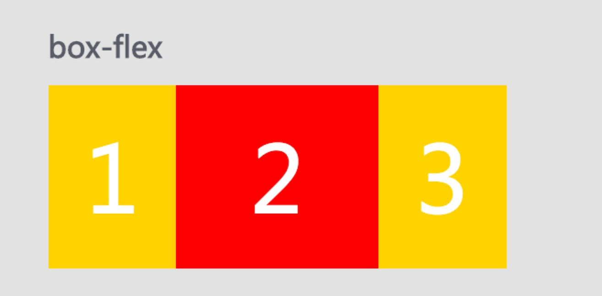
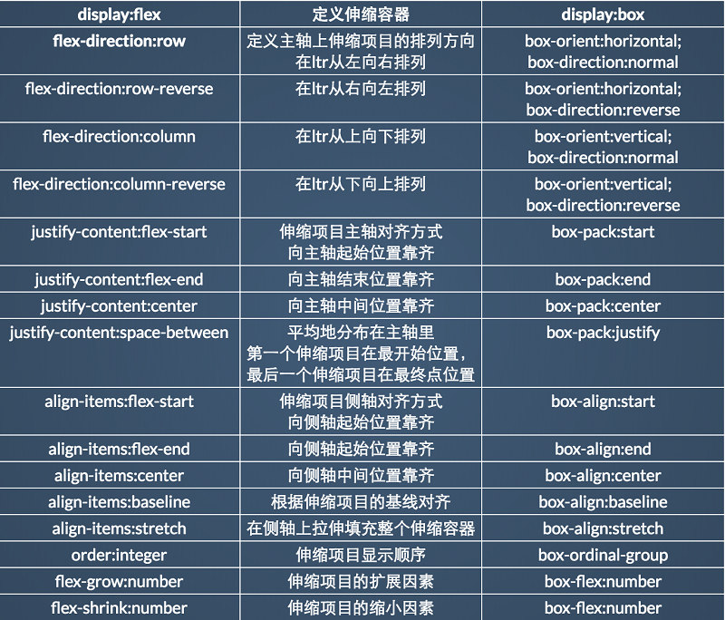

#Flex 新旧属性


###父元素的属性
属性有：box-orient, box-direction, box-align, box-pack, box-lines


1.box-orient:用来确定子元素的排列方向。可选的值有：
```
horizontal | vertical(默认) | inline-axis | block-axis | inherit
```
horizontal与inline-axis的表现似乎一致的，让子元素横排；而vertical与block-axis的表现也是一致的，让元素纵列。
<a href ="http://www.zhangxinxu.com/study/201012/css-box-orient-demo.html">box-orient值作用测试页面</a>


2.box-direction:用来确定子元素排列顺序，可选值：
```
normal | reverse | inherit
```
normal是默认值，按照正常顺序排列，

reverse表示反转，原本从左到右应该是1-2-3，结果显示为3-2-1

inherit效果同normal


3.box-align:
box-align与box-pack都是决定盒子内部剩余空间怎么使用的。在行为效果上就是表现为“对齐”.

其中box-align决定了垂直方向上的空间利用，也就是垂直方向上的对齐表现。为了便于记忆，我们可以拿来和CSS2中的vertical-align隐射记忆，两者都有”align”，都是都是垂直方向的对齐；而剩下的box-pack就是水平方向的了。

可选参数有
```
start | end | center | baseline | stretch
```
其中stretch为默认值，为拉伸，也就是父标签高度过高，其孩子元素的高度就多高。

4.box-pack：决定了父标签水平遗留空间的使用，其可选值有
```
start | end | center | justify
```
<a href="http://www.zhangxinxu.com/study/201012/css-box-pack-demo.html">box-pack属性值效果</a>


5.box-lines:决定子元素是否换行显示
```
single | multiple
```
single是默认值，表示死活不换行。
设置box-lines:multiple后，就多行显示了。不过我自己测试了下，貌似现在无论是Firefox浏览器还是Chrome都不认识box-lines:multiple属性，是暂不支持呢，还是什么什么？
<a href="http://www.zhangxinxu.com/study/201012/css-box-lines-demo.html">demo</a>

###子元素的属性
一共三个：box-flex;box-flex-group;box-ordinal-group.

box-flex-group的作用不详，貌似目前浏览器也不支持；box-ordinal-group的作用是改变子元素的顺序，数值越小，位置就越靠前。

<a href="http://www.zhangxinxu.com/study/201012/css-box-ordinal-group-demo.html">box-ordinal-group分组改序demo</a>

######box-flex属性 
box-flex的含义与作用理解为：用来按照比例分配父标签的宽度（或高度）空间。
box-flex的值为至少为1的整数是起作用。

实例1:一个宽度为500的盒子，里面有三个子元素按照2：1：1分配此盒子
```
.test_box {
    display: -moz-box; 
    display: -webkit-box; 
    display: box; 
    width:500px;

    
    ...
 }
.list {
   ...
}
.list_one {
    -moz-box-flex: 1; 
    -webkit-box-flex: 1; 
    box-flex: 1;
}
.list_two{
    -moz-box-flex: 2; 
    -webkit-box-flex: 2; 
    box-flex: 2;
}
```
```
<div class="test_box">
    <div class="list list_two">1</div>
    <div class="list list_one">2</div>
    <div class="list list_one">3</div>
</div
```
结果如图所示



实例二：当子元素有一个固定宽
```
.test_box {
    display: -moz-box; 
    display: -webkit-box; 
    display: box; 
    width:500px;
    
    ...
 }
.list {
   ...
}
.list_one {
    -moz-box-flex: 1; 
    -webkit-box-flex: 1; 
    box-flex: 1;
}
.list_two{
    -moz-box-flex: 2; 
    -webkit-box-flex: 2; 
    box-flex: 2;
}
.list_w300 { width: 300px; }
	
```
```
<div class="test_box">
    <div class="list list_two">1</div>
    <div class="list list_one">2</div>
    <div class="list list_w300">3</div>
</div>
```
结果是3独占300px，剩下的200有1和2以2：1比例平分


##FlexBox新旧属性对比


下面我们来看看是哪些新旧属性有不同：
1. flex-direction:row-reverse / box-orient:horizontal;box-direction:reverse

相同点：改变主轴方向和伸缩项目的排列顺序；在ltr下伸缩项目从右到左排列。


不同点：
flex-direction:row-reverse：第一个伸缩项目向主轴起点对齐
     box-orient:horizontal;box-direction:reverse：最后一个伸缩项目向主轴终点对齐


2.flex-direction:column-reverse / box-orient:vertical;box-direction:reverse

相同点：改变主轴方向和伸缩项目的排列顺序；
不同点：
flex-direction:column-reverse：第一个伸缩项目向主轴起点对齐。


box-orient:vertical;box-direction:reverse ：最后一个伸缩项目向主轴终点对齐


3.order:integer vs box-ordinal-group:integer
相同点：定义子元素的显示顺序
不同点： order:integer:默认值为0；可以为负值
        box-ordinal-group:integer:默认值为1，取值大于1

4.flex-grow:number / box-flex:number
相同点：定义子元素的扩展因素（大小）
不同点：box-flex:number同时定义伸缩项目的缩小因素

5.flex-shrink:number / box-flex:number
相同点：定义子元素的缩小因素（大小）
不同点：box-flex:number同时定义伸缩项目的扩展因素


###flexBox分配空间原理
影响flexBox布局分配的属性：flex-grow（放大属性）,flex-shrink（缩小属性）,flex-basis（伸缩基础，按照此值计算容器剩余空间）；

* flex-grow:当伸缩项目在主轴方向的总宽度 < 伸缩容器，伸缩项目根据扩展因素分配伸缩容器的剩余空间
* felx-shrink:当伸缩项目在主轴方向的总宽度 > 伸缩容器，伸缩项目根据缩小因素分配总宽度超出伸缩容器的空间。
* flex-basis:伸缩基础，在进行计算剩余空间或超出空间前，给伸缩项目重新设置一个宽度，然后再计算。

拉伸后的伸缩项目宽度，先简单明了的给个公式，再通过栗子来验证
>伸缩项目扩展宽度 = (项目容器宽度 - 项目宽度或项目设置的flex-basis总和) * 对应的flex-grow比例
>
>拉伸后伸缩项目宽度 = 原伸缩项目宽度 + 扩展宽度

```
.flexbox-wrap{
    width:550px;
    display: flex;
}
.flexbox-item{
    &:nth-child(1){
        width:60px;
    }
    &:nth-child(2){
        width:70px;
    }
    &:nth-child(3){
        flex-basis:80px;
    }
    &:nth-child(4){
        flex-basis:90px;
    }
    &:nth-child(5){
         flex-basis:100px;
    }
}
@for $i from 1 through 5 {
    .flexbox-item:nth-child(#{$i}){
        flex-grow: $i;
        background-color: rgba(35 * (6-$i), 20 * $i, 35 * $i,1);
    }
}
```
对应公式计算
```
// 项目容器宽度
container = 550
// 项目宽度或项目设置的flex-basis总和
itemSum = 60 + 70 + 80 + 90 + 100 = 400
// 第一个伸缩项目对应的flex-grow比例
flexRatio = 1 / ( 1 + 2 + 3 + 4 + 5 ) = 1/15
// 第一个伸缩项目扩展宽度
extendWidth = ( 550 - 400 ) * 1/15 = 10
// 第一个伸缩项目拉伸后的宽度
itemWidth = 60 + 10 = 70
```
<a href="example/flexExtend.html" target="_blank" >扩展计算</a>


伸缩项目的缩小宽度伸缩项目缩小宽度 = (项目宽度或项目设置的flex-basis总和 - 项目容器宽度) * 对应的flex-shrink比例

压缩后伸缩项目宽度 = 原伸缩项目宽度 - 缩小宽度

继续用个栗子来验证公式是否正确

```
// 项目容器宽度
container = 250
// 项目宽度或项目设置的flex-basis总和
itemSum = 60 + 70 + 80 + 90 + 100 = 400
// 第一个伸缩项目对应的flex-shrink比例
flexRatio = 1 / ( 1 + 2 + 3 + 4 + 5 ) = 1/15
// 第一个伸缩项目缩小宽度
extendWidth = ( 400 - 250 ) * 1/15 = 10
// 第一个伸缩项目压缩后的宽度
itemWidth = 60 - 10 = 50
```
计算后得到第一个伸缩项目压缩后的宽度是50px，我们通过chrome上的盒子模型来看看是否正确

chrome计算的结果和我们计算的结果不一样。

伸缩项目压缩的计算方式和拉伸的不一样，是因为压缩会有极端情况，我们把第一个伸缩项目的flex-shrink修改为10，此时缩小宽度为( 400 - 250 ) * ( 10 / 24) = 62.5，缩小的宽度比原宽度要大，计算的压缩后的宽度变成了负数。
正确的公式是这样的
>伸缩项目缩小宽度 = (项目宽度或项目设置的flex-basis总和 - 项目容器宽度) (对应的flex-shrink 项目宽度或项目设置的flex-basis比例)
>
>压缩后伸缩项目宽度 = 原伸缩项目宽度 - 缩小宽度

对应着公式一步步计算
```
// 项目容器宽度
container = 250
// 项目宽度或项目设置的flex-basis总和
itemSum = 60 + 70 + 80 + 90 + 100 = 400
// 第一个伸缩项目对应的flex-shrink比例
flexRatio = (1*60) / (1*60+2*70+3*80+4*90+5*100) = 6/130
// 第一个伸缩项目缩小宽度
extendWidth = ( 400 - 250 ) * 6/130 ≈ 6.922
// 第一个伸缩项目压缩后的宽度
itemWidth = 60 - 6.922 = 53.078
```
<a href="example/flexExtend.html#flexible" target="_blank" >伸缩计算</a>


flex-basis属性定义了在分配多余空间之前，项目占据的主轴空间（main size）。浏览器根据这个属性，计算主轴是否有多余空间。它的默认值为auto。
* flex-basis:0 -> 宽度为内容所占据的大小
* flex-basis:auto -> 如果以设置width值，按照width值计算，若没有设置，按照内容所占据的大小计算
<a href="example/flexExtend.html#flexBasis" target="_blank" >flex-basis的值demo</a>


##Flexbox属性缩写陷阱

回顾flex属性：
* flex-grow:扩展属性，默认值为0
* flex-shrink:伸缩属性，默认为1
* flex-basis:设定计算空间大小  


> flex:flex-grow [flex-shrink][flex-basis]

flex各种缩写的值
* flex:initial == flex:0 1 auto
* flex:none == flex:0 0 auto
* flex:auto == flex:1 1 auto
* flex:number == flex:number 1 0%

<a href="example/flexExtend.html#flexExample" target="_blank" >flex各种缩写的值</a>


