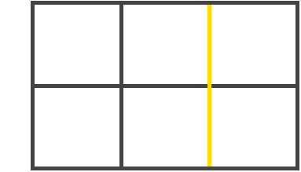
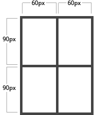
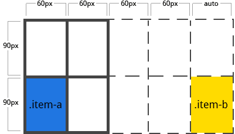
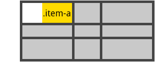

#Grid布局

css Grid 布局，是一个基于网格的二位布局系统，目的是用来优化用户界面设计。

在2017年3月左右，大部分浏览器都会开始默认支持Grid布局。

** 重要术语 **

1.网格容器

元素应用display：grid，他是起所有网格项的父元素。

2.网格项

网格容器的子元素。

3.网格线

组成网格的分界线。可以是列网格线，也可以是行网格线且居于行或列的任意一侧。


4.网格轨道
两个相邻的网格线之间为网格轨道。也可以认为他们是网格的列或行，下面的第二个和第三个网格之间的黄色部分为网格轨道。


5.网格单元
两个相邻的列网格线和两个相邻的行网格线组成的是网格单元，他是最小的网格单元。


6.网格区
网格区是由任意数量网格单元组成。


** 设置在网格容器上的属性 **

#####  1.display:grid | inline-grid | subgrid;

属性值：
* grid:生成块级网格
* inline-grid:生成行级网格
* subgrid:如果网格容器本身是网格项（嵌套网格容器），由此属性继承其父容器的列、行大小

注：当元素设置了网格布局，column/float/clear/vertical-align属性无效。

#####  2.grid-template-columns/grid-template-rows: （track-size） ... | （line-name） （track-size） ... ;


设置行和列的大小，在行轨道或列轨道两边是网格线。

属性值：
* track-size:轨道大小，可使用css长度，百分比或分数（用fr单位）
* line-name:网格线名字，可选择任何名字。

例子1：
当设置行或列大小为auto时，网格会自动分配空间和网格线名称。
```
.container{
	display:grid;
	grid-template-columns:40px 50px auto 50px 40px;
	grid-template-rows:25% 100px auto;
	width:500px;
	height:300px;
}
```
grid-template-columns后的参数有几个值，代表一行放几个子元素。

也可以给网格线定义名字注意名字要写在[]里。
例2：
```
.container{
    display:grid;
    grid-template-columns: [first] 40px [line2] 50px [line3] auto [col4-start] 50px [five] 40px [end];
    grid-template-rows: [row1-start] 25% [row1-end] 100px [third-line] auto [last-line];
}
```


每条网格线可以有多个名字，例如上面行的第二条线有两个名字，分别是row1-end和row2-start。
如果你定义包含重复部分，可以使用repeat()简化.
```
.container{
    display:grid;
    grid-template-columns: repeat(3, 20px [col-start]) 5%;
}
```
上面等同于下面：
```
.container{
    display:grid;
    grid-template-columns: 20px [col-start] 20px [col-start] 20px [col-start] 5%;
}
```
用fr单位可以将容器分为几等份,如果fr单位和实际值一起使用，设置fr的行或列将分(除了实际值)剩余部分。
```
.container{
    display:grid;
    grid-template-columns: 1fr 1fr 1fr;
}
```
#####  3.grid-template-areas
通过获取网格项中的grid-area属性值（名称），来定义网格模版。重复网格区（grid-area）名称将跨越网格单元格，‘.’代表空网格单元。

属性值：
grid-area-name: 网格项的grid-area属性值（名字）
‘.’ : 空网格单元
none: 不定义网格区域
```
.item-a{
  grid-area: header;
}
.item-b{
  grid-area: main;
}
.item-c{
  grid-area: sidebar;
}
.item-d{
  grid-area: footer;
}
.container{
    display:grid;
    grid-template-columns: 50px 50px 50px 50px;
    grid-template-rows: auto;
    grid-template-areas: "header header header header"
                         "main main . sidebar"
                         "footer footer footer footer"
}
```

<a href="example/grid.html" target="_blank" >grid-template-areas</a>

##### 4. grid-column-gap：<line-size>; 和 grid-row-gap: <line-size> ;网格单元间距。

属性值：
line-size: 网格线间距,设置单位值。

```
.container{
    display:grid;
    grid-template-columns: 100px 50px 100px;
    grid-template-rows: 80px auto 80px; 
    grid-column-gap: 10px;
    grid-row-gap: 15px;
}
```
~~ 注：间隔仅仅作用在网格单元之间，不作用在容器边缘。 ~~

##### 5. grid-gap：<grid-column-gap> <grid-row-gap>;

是grid-column-gap 和 grid-row-gap简写。
#####  6. justify-items: start | end | center | stretch（默认） ;


垂直于列网格线对齐，适用于网格容器里的所有网格项。

属性值：
* start: 左对齐。
* end: 右对齐。
* center: 居中对齐。
* stretch: 填满（默认）
```
.container{
  display:grid;
  justify-items:start;
}
```


** justify-items:end; ** 


** justify-items:center; ** 


** justify-items:stretch; ** 


##### 7. align-items: start | end | center | stretch ;

垂直于行网格线对齐，适用于网格容器里的所有网格项。

属性值：
* start： 顶部对齐。
* end： 底部对齐。
* center： 居中对齐。
* stretch：填满（默认）。


#####  8. justify-content: start | end | center | stretch | space-around | space-between | space-evenly ;

如果用像px非弹性单位定义的话，总网格区域大小有可能小于网格容器，这时候你可以设置网格的对齐方式（垂直于列网格线对齐）。

属性值：
* start: 左对齐。
* end: 右对齐。
* center: 居中对齐。
* stretch: 填满网格容器。
* space-around: 网格项两边间距相等，网格项之间间隔是单侧的2倍。
* space-between: 两边对齐，网格项之间间隔相等。
* space-evenly: 网格项间隔相等。

** justify-content:start; ** 


** justify-content:end; ** 


** justify-content:center; ** 


** justify-content:space-around; ** 


** justify-content:space-between; ** 


** justify-content:space-evenly; ** 


##### 9.align-content: start | end | center | stretch | space-around | space-between | space-evenly ;

如果用像px非弹性单位定义的话，总网格区域大小有可能小于网格容器，这时候你可以设置网格的对齐方式（垂直于行网格线对齐）。

属性值：
* start: 顶部对齐。
* end: 底部对齐。
* center: 居中对齐。
* stretch: 填满网格容器。
* space-around: 网格项两边间距相等，网格项之间间隔是单侧的2倍。
* space-between: 两边对齐，网格项之间间隔相等。
* space-evenly: 网格项间隔相等。

##### 10.grid-auto-columns/grid-auto-rows: <track-size> ... ;

自动生成隐式网格轨道（列和行），当你定位网格项超出网格容器范围时，将自动创建隐式网格轨道。

属性值：
* track-size: 网格轨道大小,可以是固定值，百分比或者是分数（fr单位）。

```
.container{
    display:grid;
    grid-template-columns: 60px 60px;
    grid-template-rows: 90px 90px
}
```
会形成如图一个2*2的网格：



我们用grid-column和grid-row给网格项定位如下：
```
.item-a{
    grid-column: 1 / 2;
    grid-row: 2 / 3;
}
.item-b{
    grid-column: 5 / 6;
    grid-row: 2 / 3;
}
```


我们可以看出，网格项item-b定位在第五根列网格线（column line 5 ）和第六根列网格线（column line 6 ）之间。但是我们网格容器根本不存在这两条网格线，所以就用两个0宽度来填充。在这里我们可以用网格自动行（grid-auto-rows）和网格自动列（grid-auto-columns）来定义这些隐式轨道宽度。

```
.container{
    display:grid;
    grid-auto-columns: 60px;
}
```


##### 11. grid-auto-flow : row（默认） | column | dense ;

在没有设置网格项的位置时，这个属性控制网格项怎样排列。


属性值：
* row: 按照行依次从左到右排列。
* column: 按照列依次从上倒下排列。
* dense: 按先后顺序排列

##### 12. grid: none | <grid-template-rows> / <grid-template-columns> | <grid-auto-flow> [<grid-auto-rows> [ / <grid-auto-columns>] ];

是一种简写形式，设置网格容器所有属性。

属性值：
none: 设置为所有属性的默认值。

<grid-template-rows> / <grid-template-columns>: 设置行和列的值，其他属性为默认值。

<grid-auto-flow> [ <grid-auto-rows> [ / <grid-auto-columns>] ] : 设置网格自动流、网格自动行、网格自动列的值，其他未设置则为默认值。

** 设置在网格项上的属性 ** 

##### 1 1. grid-column-start/grid-column-end/grid-row-start/grid-row-end: <number> | <name> | span <number> | span <name> | auto ;

通过网格线来定义网格项的位置。grid-column-start、grid-row-start定义网格项的开始位置，grid-column-end、grid-row-end定义网格项的结束位置。

属性值：
* line: 指定带编号或者名字的网格线。
* span <number>: 跨越轨道的数量。
* span <name>: 跨越轨道直到对应名字的网格线。
* auto: 自动展示位置，默认跨度为1。

#####  2. grid-column/grid-row: <start-line> / <end-line> | <start-line> / span <value> ;

是 grid-column-start、grid-column-end 和 grid-row-start、grid-row-end 的简写。

```
.item-c{
  grid-column: 3 / span 2;
  grid-row: third-line / 4;
}
```


##### 3.grid-area: <name> | <row-start> / <column-start> / <row-end> / <column-end>

定义网格项名字，以便创建模块（容器属性grid-template-areas来定义模块）。

属性值：
name: 项目名子。

<row-start> / <column-start> / <row-end> / <column-end>: 可以是数字或网格线名字。

定义网格项名字
```
.item-d{
  grid-area: header
}
```
通过网格线定位网格项
```
.item-d{
  grid-area: 1 / col4-start / last-line / 6 ;
}
```


##### 4. justify-self: justify-self: start | end | center | stretch;

定义单个网格项垂直于列网格线的对齐方式。

也可以在容器上设置justify-items，达到全部网格项对齐。

属性值：
* start: 网格区域左对齐。
* end: 网格区域右对齐。
* center: 网格区域居中。
* stretch: 网格区域填满。


```
.item-a{
  justify-self: start;
}
```

```
.item-a{
  justify-self: end;
}
```

```
.item-a{
  justify-self: center;
}
```

```
.item-a{
  justify-self: stretch;
}
```


##### 5. align-self: start | end | center | stretch;

定义单个网格项垂直于行网格线的对齐方式。

也可以在容器上设置align-items，达到全部网格项对齐。

属性值：
* start: 网格区域顶部对齐。
* end: 网格区域底部对齐。
* center: 网格区域居中。
* stretch: 网格区域填满

```
.item-a{
  align-self: start;
}
```

```
.item-a{
  align-self: end;
}
```

```
.item-a{
  align-self: center;
}
```

```
.item-a{
  align-self: stretch;
}
```


