### node.js简介

**Node.js不是JS应用、而是JS运行平台**

```
看到Node.js这个名字，初学者可能会误以为这是一个Javascript应用，事实上，Node.js采用C++语言编写而成，
是一个Javascript的运行环境。为什么采用C++语言呢？据Node.js创始人Ryan Dahl回忆，他最初希望采用Ruby
来写Node.js，但是后来发现Ruby虚拟机的性能不能满足他的要求，后来他尝试采用V8引擎，所以选择了C++语言。
既然不是Javascript应用，为何叫.js呢？因为Node.js是一个Javascript的运行环境。提到Javascript，大家
首先想到的是日常使用的浏览器，现代浏览器包含了各种组件，包括渲染引擎、Javascript引擎等，其中Javascript
引擎负责解释执行网页中的Javascript代码。作为Web前端最重要的语言之一，Javascript一直是前端工程师的专利。
不过，Node.js是一个后端的Javascript运行环境（支持的系统包括*nux、Windows），这意味着你可以编写系统级
或者服务器端的Javascript代码，交给Node.js来解释执行，简单的命令类似于：

#node helloworld.jsNode.js

采用了Google Chrome浏览器的V8引擎，性能很好，同时还提供了很多系统级的API，如文件操作、网络编程等。
浏览器端的Javascript代码在运行时会受到各种安全性的限制，对客户系统的操作有限。相比之下，Node.js则
是一个全面的后台运行环境，为Javascript提供了其他语言能够实现的许多功能。

```

```
1. 简单的说Node.js就是运行在服务端的JavaScript

2. Node.js是一个基于Chrome JavaScript运行时建立的一个平台

3. Node.js是一个事件驱动I/O服务端JavaScript环境(由C++编写),
基于Google的V8引擎，V8引擎执行JavaScript的速度非常快，性能非常好。

```
**解释**：

**V8引擎:**
```
谷歌浏览器的一个引擎,将javascript编译成原生机器码(二进制码),
运行速度媲美二进制程序,V8可以独立运行,也可以嵌入到任何C++应用程序。

```
**事件驱动I/O:**

(1)系统线程模型


(2)多线程、线程池模型


```
服务端与客户端每建立一个连接，都要为这个连接分配一套配套的资源，主要体现为系统
内存资源，以PHP为例，维护一个连接可能需要20M的内存。这就是为什么一般并发量一大，
就需要多开服务器。

```

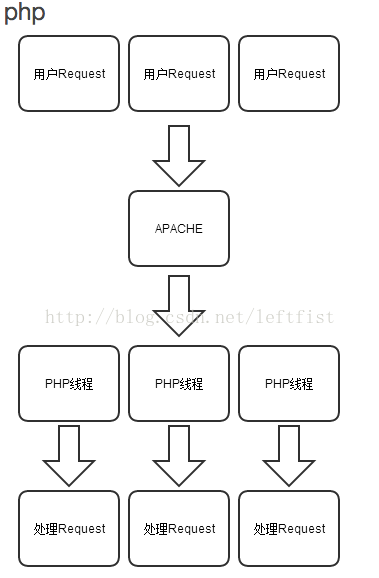

(3)异步、事件驱动模型(以点餐为例)

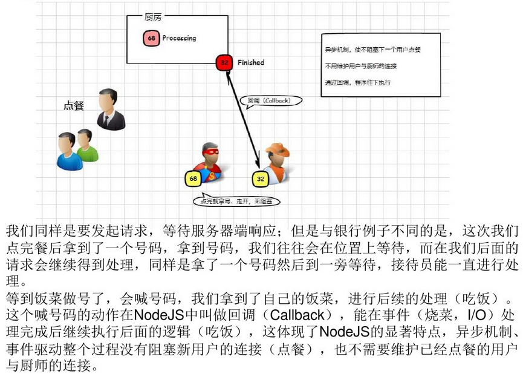

**Apache:**

Apache HTTP Server（简称Apache），是Apache软件基金会的一个开放源
代码的网页服务器。

### node.js特点

```
1.它是一个JavaScript运行环境(c++实现)

2.依赖于Chrome V8引擎进行代码解释

3.事件驱动

4.非阻塞I/O

5.轻量、可伸缩，适于实时数据交互应用

6.单进程、单线程

7.模块化编程

8.事件轮询(event loop)

```

### Node.js发展简史

```
2009年2月，Ryan Dahl在博客上宣布准备基于V8创建一个轻量级的Web服务器并提供一套库。

2009年5月，Ryan Dahl在GitHub上发布了最初版本的部分Node.js包，随后几个月里，有人开始使用Node.js开发应用。

2009年11月和2010年4月，两届JSConf大会(js中国开发者大会)都安排了Node.js的讲座。

2010年年底，Node.js获得云计算服务商Joyent(一个提供云计算服务的公司)资助，创始人Ryan Dahl加入
Joyent全职负责Node.js的发展。

2011年7月，Node.js在微软的支持下发布Windows版本。

2011年11月，Node超越Ruby on Rails(一个可以使你开发、部署、维护web应用程序变得简单的框架,构建在Ruby
语言之上),成为GitHub上关注度最高的项目(随后被Bootstrap项目超越，目前仍居第二)。

2012年1月底,Ryan Dahl在对Node框架设计满意的情况下，将掌门人的身份转交给lsaac Z.Schlueter,自己
转向一些研究项目。lsaac Z.Schlueter是Node的包管理器NPM的作者，之后Node的版本发布和bug修复等工作由他接手。

2013年7月，发布稳定版v0.10.13

随后，Node的发布计划主要集中在性能上面V0.14后正式发布V1.0版本

```

### node.js架构(全局)

**1. 从模块依赖关系看Node.js架构**

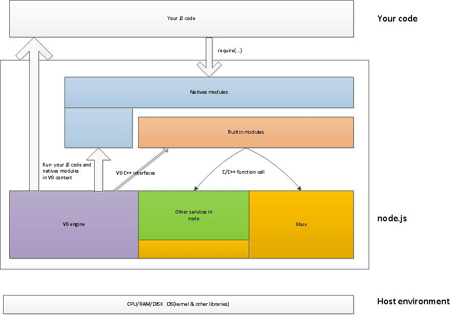

```
1.1 Host environment

下载Node.js的源代码，并且编译的话,生成一个可执行文件，既然是可执行文件，其运行
时必然依赖执行环境，即宿主环境,node运行需要OS提供各种服务，如文件访问，socket
编程(网络进程间通信,同机进程间通信可以用进程号标识，网络进程间通信用（ip地址，协
议，端口）标识)，OpenSSL(一个安全套接字层密码库)，多进程，多线程，锁，异步I/O库
等等。

1.2 Node.js

中间的部分展示了Node.js的主要组成部分:V8 engine, libuv, builtin modules, natives modules
以及其它辅助服务代码。

Node.js以源代码形式将V8 engine包含在自己的代码树里面。V8 engine在Node.js里面起到两个重要的作用：

1. 作为虚拟机，执行JS代码。包括我们自己写的JS代码、第三方JS代码以及natives module
2. 提供C++函数接口，为Node.js提供包括V8初始化、创建context(上下文), scope、为builtin module模拟
生成JS prototype-based class(基于js原型的类)、各种模版等服务。

Node.js里面有一个大神，libuv，它是基于事件驱动的异步I/O模型库。我们的JS代码发起的异步请求，
\最终由libuv完成，而我们所设置的回调函数则由libuv最初触发。也就是说，异步请求由我们的JS代码发起
，由libuv完成，而回调函数的执行则由libuv最初触发。

Node.js提供了一些辅助函数，如String_byte.cc里面的base64编解码函数，它们存在的意义是为
builtin modules提供服务。

V8 engine提供的函数接口，libuv提供的异步I/O模型库以及Node.js提供的其他辅助函数一起为
builtin modules提供了生存的土壤。Builtin modules是由C++代码写成的各类模块，涵盖了
crypto(主要功能加密解密)，zlib(压缩功能), file stream在内的各种基础功能。

Node.js还包含了Natives modules。它是由JS写成的，供我们的应用程序调用的库。同时，这些模块又
依赖builtin module来获得相应的支持服务。例如我们在建立一个http server时所用到的http_server.js
，其背后的支撑者是tcp_wrap.cc和libuv。

如果把node.js看成一个黑盒子的话，其暴露给我们开发者的接口则是Native modules。当我们
的代码发起异步请求时，请求自上而下，穿越Natvie module，通过builtin module将请求传递
给V8, libuv和node.js辅助服务。而当请求结束，则从下回溯而上，最终调用我们的请求回调函数。
需要强调的是，这里面的自上而下和自下而上的两个过程中间会相隔很远的时间。而这个时间差会被用
来执行更多的其它代码。

1.3 我们的JS code

我们的JS code，依赖第三方模块以及Native modules完成自身业务需求。 假如我们的服务程序入口是
fooserv.js，那么通过 node fooserv.js启动我们的服务时，node会先做一些包括V8初始化,libuv
启动在内的准备工作，然后交由V8 engine来执行Native module以及我们的JS代码。(模块加载流程可以
在以后再详细介绍)

```

**解释**

**builtin module:**

Node中以c++形式提供的模块，如tcp_wrap、contextify等。

**native module:**

Node中以JavaScript形式提供的模块，如http,https,fs等。有些native module
需要借助于builtin module实现背后的功能。如对于native模块buffer ,还是需要借助builtin
node_buffer.cc中提供的功能来实现大容量内存申请和管理，目的是能够脱离V8内存大小使用限制。

**libuv**

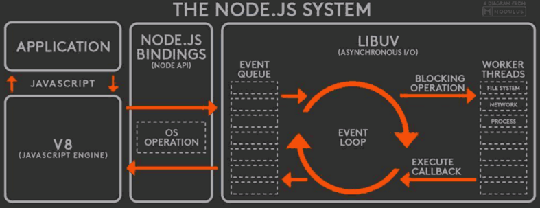

libuv使用异步，事件驱动的编程方式，核心是提供i/o的事件循环和异步回调。libuv的API包含有时间，
非阻塞的网络，异步文件操作，子进程等等。

**scope**

所有npm模块都有name，有的模块的name还有scope。scope的命名规则和name差不多，同样不能有url非
法字符或者下划线点符号开头。scope在模块name中使用时，以@开头，后边跟一个/。package.json中，
name的写法如下:

@somescope/somepackagename

scope是一种把相关的模块组织到一起的一种方式，也会在某些地方影响npm对模块的处理。


**2. 从函数调用流程看Node.js架构**

从函数方面看可能比较复杂一点(在此我把链接发这，我打算在下一次分享时首先再介绍这部分)

[node架构](https://cnodejs.org/topic/5594ada26ba28efa30a604e2)


### node.js优缺点

```
优点：

1）简单

2）高性能，避免了频繁的线程切换开销

3）占用资源小，因为是单线程，在大负荷情况下，对内存占用仍然很低

3）线程安全，没有加锁、解锁、死锁这些问题

```

```
缺点：

1）CPU密集型任务存在短板:

nodejs的机制是单线程，这个线程里面，有一个事件循环机制，处理所有的请求。在事件
处理过程中，它会智能地将一些涉及到IO、网络通信等耗时比较长的操作，交由worker threads
(线程池)去执行，执行完了再回调，这就是所谓的异步IO非阻塞。但是，那些非IO操作，只用CPU
计算的操作，它就自己扛了，比如算什么斐波那契数列之类。它是单线程，这些自己扛的任务要一个
接着一个地完成，前面那个没完成，后面的只能干等。因此，对CPU要求比较高的CPU密集型任务多
的话，就有可能会造成号称高性能，适合高并发的node.js服务器反应缓慢。

2）无法利用CPU的多核:

最开始，线程只是用于分配单个处理器处理事件的一种机制。但假如操作系统本身支持多个CPU/内核，
那么每个线程都可以得到一个不同的CPU/内核，实现真正的“并行运算”。在这种情况下，多线程
程序可以提高资源使用效率。Node.js是单线程程序，它只有一个event loop，也只占用一个CPU/内核。
现在大部分服务器都是多CPU或多核的，当Node.js程序的event loop被CPU密集型的任务占用，
导致有其它任务被阻塞时，却还有CPU/内核处于闲置的状态，造成资源的浪费。

解决方案:

利用原生模块或第三方模块，开辟进程或子进程，用于处理这些特殊的任务。

3）如果有异常抛出，因为是单线程，整个项目将不可用。

```

### node.js适用场景

**1、RESTful API**

```
这是适合 Node 的理想情况，因为您可以构建它来处理数万条连接。它仍然不需要大量逻辑；它本
质上只是从某个数据库中查找一些值并将它们组成一个响应。由于响应是少量文本，入站请求也是少
量的文本，因此流量不高，一台机器甚至也可以处理最繁忙的公司的API需求。

```

**解释**

**RESTful API:**

说这个之前要先了解REST和RESTful:(阮一峰的博客分享的很好)

[RESTful架构](http://www.ruanyifeng.com/blog/2011/09/restful.html)

找到一个好玩的通俗解释的图:

首先我们假设西雅图有个男孩叫小明，他是一个科比的粉丝，然后有一天小明想用电脑看科比的
生涯集锦视频。他做了如下四步：


在这个活动中，主要涉及到了四个部件：


这大概就是一个传统的电脑软件的架构。现在我们看看如何把这个传统的电脑软件变成RESTful架构
的软件。

我们把小明家的电脑主机从小明西雅图搬到加州的圣布鲁罗，而小明的显示器则仍然留在家里。

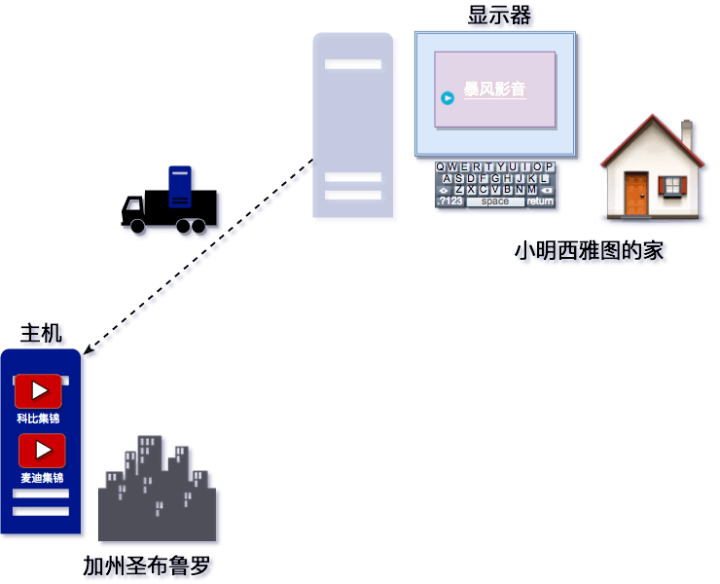

然后我们把之前连接电脑主机和显示器的“电线”换成“互联网”，并且把四个部件（显示器，主机，
视频文件，暴风影音软件）的名字换成：客户端，服务器，资源，浏览器。

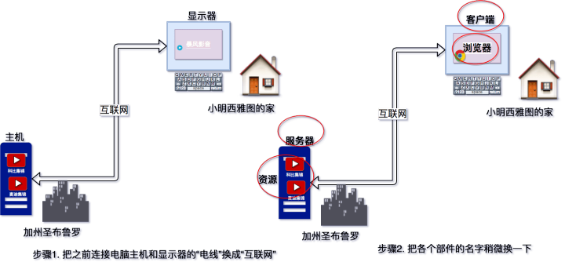

为了在茫茫互联网世界中准确快速的找到那台服务器并观看“科比集锦”，我们需要给在加州圣布鲁罗的
这台服务器加一个标识符，也就是常说的Url。 同时，为了区分服务器中的“科比集锦”和“麦迪集锦”，
我们也需要给这两个视频单独加上标识符。

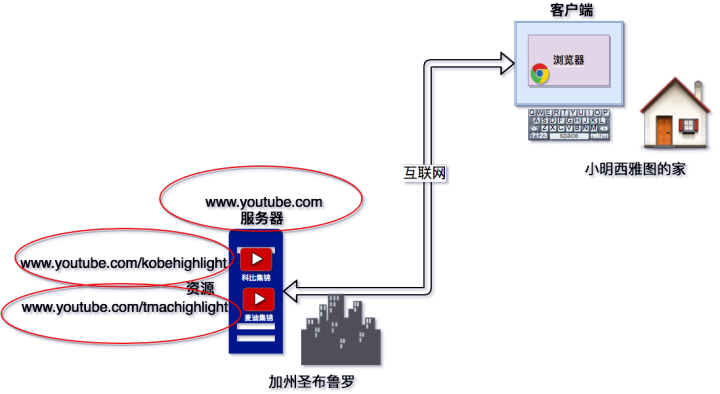

这个服务器当然不只有科比和麦迪的视频，还有其他千千万万的视频，以及音乐，表单和网页等等东西。
服务器上放不下这么多东西，所以需要把这些东西移到数据库里面放着。

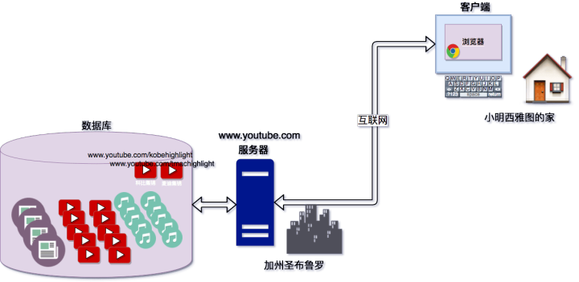

这样，整个RESTFul的架构基本上就成型了。我们再来看看小明今天应该如何观看科比的视频。

步骤1. 小明打开浏览器。注意此时小明家中的电脑硬盘里面没有存任何视频，视频存在加州圣布鲁罗的数
据库里面。


步骤2.小明输入 http://www.youtube.com/kobehighlight 客户端通过互联网找到http://www.youtube.com
的服务器，然后服务器根据kobehighlight在数据库里找到了科比的视频, 并把视频数据通过互联网传回给了
小明的客户端。这个操作就是我们常说的GET。

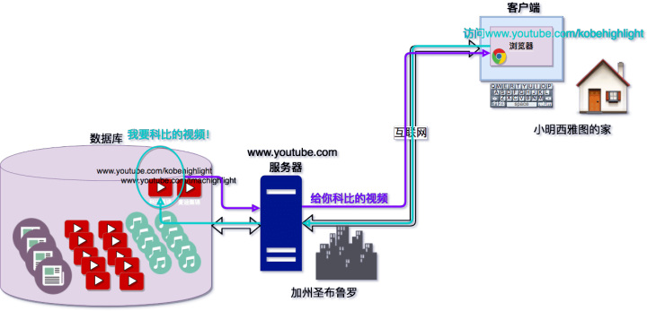

步骤3. 小明开心地观看传回来的视频，但是他不想在视频中看到克雷汤普森。

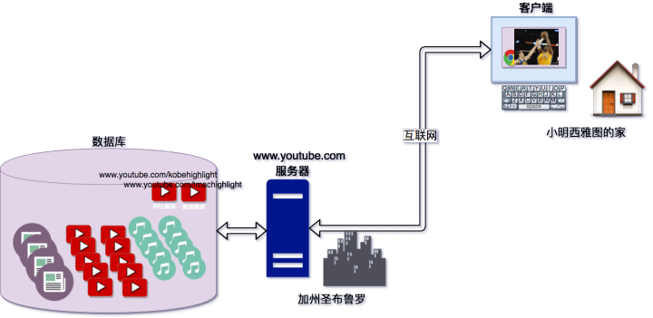

步骤4. 他通过浏览器剪掉了克雷汤普森的部分，点击了”提交“，然后服务器接到这个请求之后把修改保存到数据
库里面，并且告诉小明”你的修改已经保存。这个操作就是我们常说的POST。

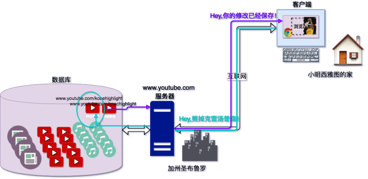

```
我们来对比一下之前的单机软件。

单机软件的文件路径 = REST软件的Url

单机软件的打开操作 = REST软件HTTP的GET

单机软件的保存操作 = REST软件HTTP的POST

```

好了说了这么多，这有一个网址可以看看什么是RESTful API:

[RESTful API](http://www.ruanyifeng.com/blog/2014/05/restful_api.html)


**2、实时程序**

```
比如聊天服务

聊天应用程序是最能体现Node.js优点的例子：轻量级、高流量并且能良好的应对跨平台设备上运行密集型
数据（虽然计算能力低）。

在最简单的情况下，我们布置了一个聊天室在我们的网站上，用户可以在上面发消息，当然是一对多的形式。
例如，假设总共有三个人连接到我们的网站上。

在服务端这边,我们有一个使用Express.js搭建的简单站点，该站点实现了两件事 1) 处理路径为 ‘/’
的GET请求时,下发包括一个留言板以及一个发送信息的‘发送’按钮的页面 2) 一个监听客户端发送新消息的
websockets服务。(websockets具体后面在后面再解释)

在客户端这边，我们有一个HTML页面，上面有个两个js方法，一个是用于触发事件的“发送”按钮，这会把
输入的消息通过webscoket发送，另一个方法是用webscoket在客户端上监听服务端来的推送（例如，其他
用户发送的消息）。

当有一个客户端发送消息的时候，发生的事情是：

1. 浏览器上，点击发送按钮触发了js函数，将输入框中的文字通过websocket消息发送到服务器的websocket
客户端（页面初始化加载的时候连接的）。
2. 服务端的websocket组件收到消息，然后通过广播方法转发到其他所有连接的客户端。
3. 通过页面上运行的websocket客户端组件，所有的客户端都能收到这条推送的新消息。接着js处理函数可以
把这个消息添加到文字框内。

```

**3、单页APP**

```
ajax很多。现在单页的机制似乎很流行，比如phonegap(采用HTML，CSS和JavaScript的技术，创建移动跨平
  台移动应用程序的快速开发平台)做出来的APP，一个页面包打天下的例子比比皆是。

```

**解释**

**单页面和多页面**

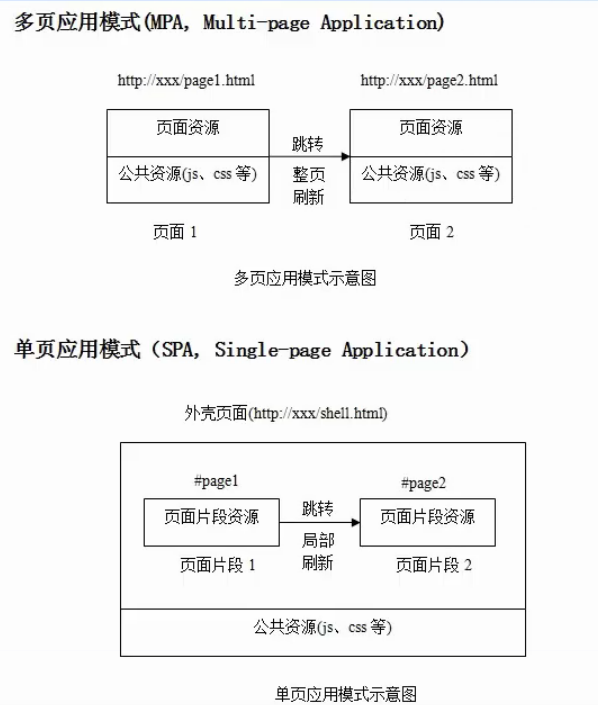

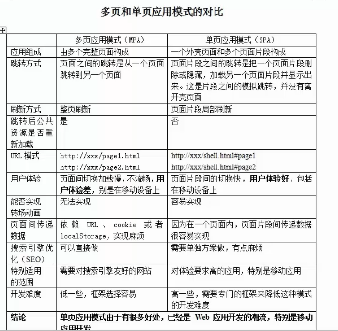
